# **1. 实现模型**

## **1.1 上下文视图**

### 系统上下文图

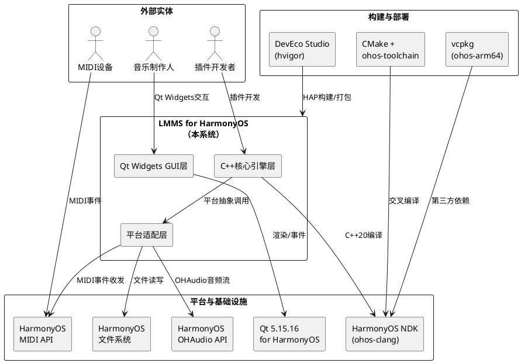

### 核心设计原则

| 原则 | 说明 |
|------|------|
| **平台条件编译** | 所有鸿蒙适配代码通过 `#ifdef LMMS_BUILD_OHOS` 隔离，不修改LMMS核心业务逻辑 |
| **接口继承替换** | 通过继承AudioDevice/MidiClient基类实现鸿蒙后端，遵循LMMS已有抽象层设计 |
| **HAP嵌入模式** | Qt应用以共享库形式嵌入HAP包，通过ETS入口加载，非独立进程 |
| **分Phase增量实施** | 严格按Phase 1→2→3→4→5顺序推进，每Phase有独立验收标准 |
| **上游代码尊重** | 移植修改尽量通过CMake选项和条件编译宏实现，保持与LMMS上游代码结构对应 |

## **1.2 服务/组件总体架构**

### 分层架构图

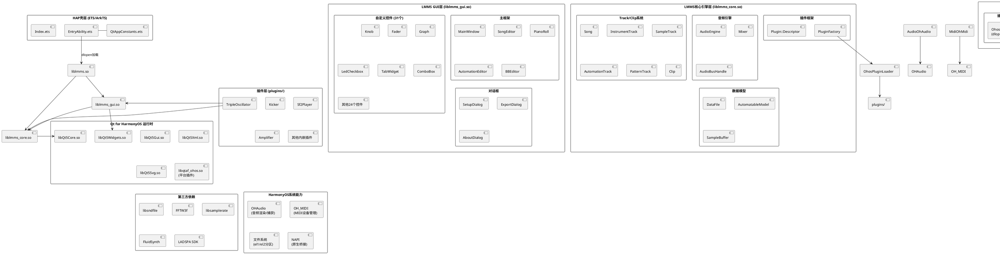

### 模块职责划分

| 模块 | 职责 | 关键文件/目录 | 对应Phase |
|------|------|---------------|-----------|
| **HAP壳层** | 应用入口、Qt加载、生命周期管理 | `LMMS_for_HMOS/entry/src/main/ets/` | Phase 1 |
| **Qt运行时** | GUI渲染、事件循环、信号槽 | Qt 5.15.16 for HarmonyOS编译产物 | Phase 1 |
| **LMMS GUI层** | 主窗口、编辑器、31个自定义控件、对话框 | `lmms-master/src/gui/` | Phase 1 |
| **LMMS核心引擎** | 音频引擎、Track/Clip、数据模型、插件框架 | `lmms-master/src/core/` | Phase 1 |
| **AudioOhAudio** | OHAudio音频后端（AudioDevice子类） | `src/core/audio/AudioOhAudio.h/.cpp` | Phase 2 |
| **MidiOhMidi** | HarmonyOS MIDI后端（MidiClient子类） | `src/core/midi/MidiOhMidi.h/.cpp` | Phase 3 |
| **OhosFileSystem** | 鸿蒙文件路径映射 | `src/core/OhosFileSystem.h/.cpp`（新增） | Phase 1 |
| **OhosPluginLoader** | HAP内插件dlopen加载 | `src/core/OhosPluginLoader.h/.cpp`（新增） | Phase 4 |
| **插件层** | 乐器/效果器/工具插件共享库 | `lmms-master/plugins/` | Phase 4 |
| **第三方依赖** | 音频编解码/FFT/采样率转换/SF2 | vcpkg ohos-arm64 triplet | Phase 1 |

## **1.3 实现设计文档**

### 1.3.1 Phase 1: Qt for HarmonyOS环境搭建与GUI基本显示

#### 1.3.1.1 CMake构建系统适配

**工具链配置** (`cmake/ohos-toolchain.cmake`)

已完成实现，核心配置：

```cmake
set(CMAKE_SYSTEM_NAME OHOS)
set(CMAKE_C_COMPILER "${OHOS_LLVM_DIR}/bin/clang")
set(CMAKE_CXX_COMPILER "${OHOS_LLVM_DIR}/bin/clang++")
set(CMAKE_CXX_FLAGS "${CMAKE_CXX_FLAGS} --target=aarch64-linux-ohos -march=armv8-a")
set(CMAKE_CXX_STANDARD 20)
set(LMMS_BUILD_OHOS 1 CACHE INTERNAL "Building for HarmonyOS")
```

**根CMakeLists.txt平台分支**

```
OHOS平台条件逻辑：
├── 添加 WANT_OHAUDIO / WANT_OH_MIDI 构建选项
├── 禁用 WANT_ALSA / WANT_JACK / WANT_OSS / WANT_PULSEAUDIO / WANT_SDL
├── 禁用 WANT_LV2 / WANT_CARLA / WANT_VST
├── 设置 LMMS_BUILD_OHOS 宏
└── 设置 Qt for HarmonyOS 查找路径 (CMAKE_PREFIX_PATH)
```

**src/core/CMakeLists.txt 平台条件编译**

```
音频后端选择：
├── LMMS_BUILD_OHOS → 编译 AudioOhAudio.cpp, 链接 OHAudio
├── LMMS_BUILD_LINUX → 编译 AudioAlsa/AudioJack/AudioPulse等
└── LMMS_BUILD_WIN32 → 编译 AudioSdl/AudioPortAudio等

MIDI后端选择：
├── LMMS_BUILD_OHOS → 编译 MidiOhMidi.cpp, 链接 OH_MIDI
├── LMMS_BUILD_LINUX → 编译 MidiAlsaSeq/MidiJack等
└── LMMS_BUILD_WIN32 → 编译 MidiWinMM等

LV2/Carla排除：
└── LMMS_BUILD_OHOS → 跳过 Lv2ViewBase, weakjack
```

#### 1.3.1.2 HAP入口设计

**EntryAbility加载流程**

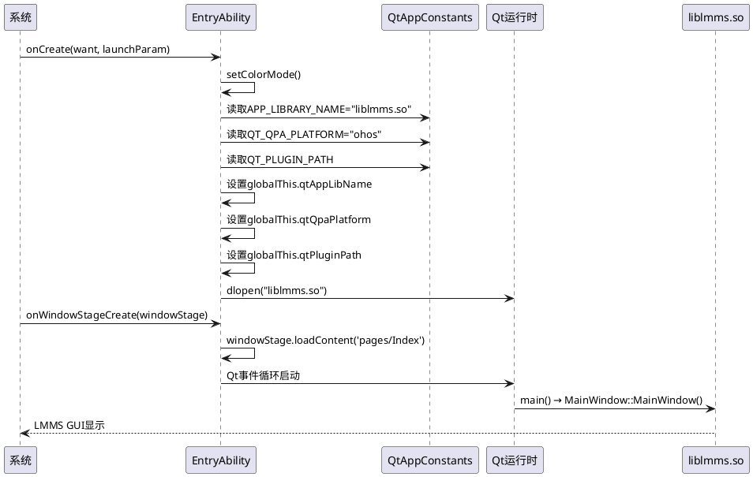

**QtAppConstants配置**

| 常量 | 值 | 说明 |
|------|------|------|
| `APP_LIBRARY_NAME` | `liblmms.so` | LMMS主共享库名称 |
| `QT_PLUGIN_PATH` | `/data/storage/el1/bundle/libs/arm64` | Qt插件搜索路径（HAP内部） |
| `QT_QPA_PLATFORM` | `ohos` | Qt平台抽象插件标识 |
| `QT_PLATFORM_PLUGIN` | `libqtaf_ohos.so` | Qt鸿蒙平台插件库名 |

**module.json5权限配置**

| 权限 | 用途 |
|------|------|
| `ohos.permission.READ_MEDIA` | 读取音频采样文件 |
| `ohos.permission.WRITE_MEDIA` | 保存项目/导出音频文件 |
| `ohos.permission.ACCESS_DLP_FILE` | 访问文档类文件 |

#### 1.3.1.3 文件系统适配 (OhosFileSystem)

鸿蒙应用运行在沙箱环境中，需要将LMMS原有的Linux文件路径映射到鸿蒙应用私有目录。

**类设计**

```cpp
// OhosFileSystem.h (新增)
namespace lmms {

class OhosFileSystem {
public:
    // 获取应用私有数据目录
    static QString appDataDir();
    // 获取应用私有缓存目录
    static QString appCacheDir();
    // 获取HAP内资源目录（只读）
    static QString appResourceDir();
    // 获取插件目录
    static QString pluginDir();
    // 获取LMMS数据目录（替代~/.lmms/）
    static QString lmmsDataDir();
    // 获取采样文件默认目录
    static QString samplesDir();
    // 获取预设目录
    static QString presetsDir();
    // 路径映射：Linux路径 → 鸿蒙路径
    static QString mapPath(const QString& linuxPath);

private:
    static QString s_appDataDir;  // 缓存
};

} // namespace lmms
```

**路径映射表**

| Linux路径 | 鸿蒙映射路径 | 说明 |
|-----------|-------------|------|
| `~/.lmms/` | `/data/storage/el2/base/files/.lmms/` | LMMS配置和数据 |
| `~/.lmms/samples/` | `/data/storage/el2/base/files/.lmms/samples/` | 采样文件 |
| `~/.lmms/presets/` | `/data/storage/el2/base/files/.lmms/presets/` | 预设文件 |
| `/usr/share/lmms/` | `/data/storage/el1/bundle/files/` | HAP内只读资源 |
| `plugins/` | `/data/storage/el1/bundle/libs/arm64/plugins/` | 插件目录 |

**ConfigManager适配**

在 `#ifdef LMMS_BUILD_OHOS` 条件下，`ConfigManager::workingDir()` 和 `ConfigManager::dataDir()` 返回 `OhosFileSystem` 映射的路径。

#### 1.3.1.4 GUI适配要点

**31个自定义控件清单及适配状态**

| 控件类 | 用途 | 适配要点 |
|--------|------|----------|
| `Knob` | 连续参数旋转控件 | paintEvent使用QPainter，Qt for HarmonyOS QPainter可用 |
| `Fader` | 垂直滑块 | 同Knob，QPainter绘制 |
| `Graph` | 曲线/自动化编辑 | 复杂鼠标交互，需验证QMouseEvent映射 |
| `ComboBox` | 下拉选择 | QComboBox子类，Qt原生支持 |
| `LedCheckbox` | 带LED指示的复选框 | QPainter绘制LED指示器 |
| `TabWidget` | 标签页 | QTabWidget子类 |
| `GroupBox` | 分组框 | QGroupBox子类 |
| `PixmapButton` | 图片按钮 | QPixmap加载需验证资源系统 |
| `TextFloat` | 浮动文本提示 | QPainter + QWidget::setWindowFlags |
| `FadeButton` | 渐变按钮 | QPainter渐变绘制 |
| `Meter` | 音量表 | QPainter实时绘制 |
| `LcdWidget` | LCD数字显示 | QPainter绘制7段数码管 |
| `NotePlayHandle` | 音符播放 | 不涉及GUI |
| 其余18个 | 各类编辑器内嵌控件 | 基于QPainter/QWidget，Qt for HarmonyOS应可支持 |

**触摸事件映射设计**

鸿蒙平台触摸事件通过Qt for HarmonyOS平台插件自动映射为QMouseEvent：
- `OH_TOUCH_DOWN` → `QEvent::MouseButtonPress` (Qt::LeftButton)
- `OH_TOUCH_MOVE` → `QEvent::MouseMove` (Qt::LeftButton)
- `OH_TOUCH_UP` → `QEvent::MouseButtonRelease` (Qt::LeftButton)

此映射由 `libqtaf_ohos.so` 平台插件内部处理，LMMS代码无需修改。

### 1.3.2 Phase 2: 音频引擎鸿蒙适配（OHAudio API）

#### 1.3.2.1 AudioOhAudio完整实现设计

**类图**

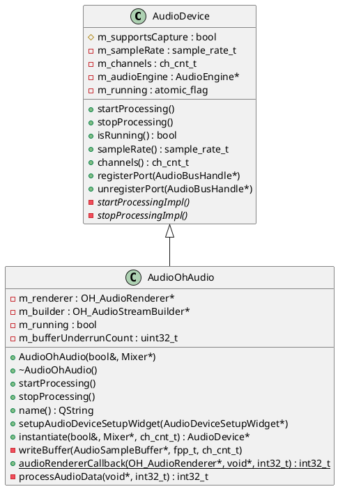

**OHAudio API调用序列**

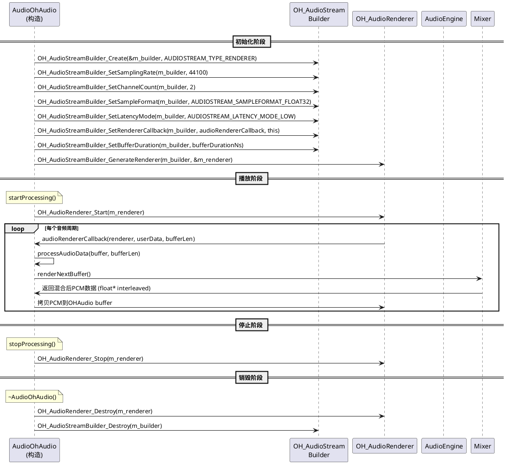

**processAudioData核心算法**

```
算法: processAudioData(buffer, bufferLen)
输入: buffer - OHAudio提供的PCM输出缓冲区指针
      bufferLen - 缓冲区长度（帧数 × 声道数）

1. frames = bufferLen / channels  // 计算帧数
2. 调用 mixer->renderNextBuffer()  // 渲染下一缓冲区
3. 获取渲染后的AudioSampleBuffer (interleaved float32 PCM)
4. 将AudioSampleBuffer数据拷贝到buffer:
   memcpy(buffer, renderedData, frames * channels * sizeof(float))
5. 若渲染数据不足（欠载）:
   a. 零填充剩余部分: memset(remaining, 0, remainingBytes)
   b. m_bufferUnderrunCount++
   c. 每100次欠载输出一次警告日志
6. return 0  // 返回0表示成功
```

**writeBuffer实现说明**

`writeBuffer()` 在OHAudio回调模式下不需要实现（由回调驱动），保留空实现以满足基类纯虚函数接口。OHAudio采用"拉"模式：系统通过回调请求数据，LMMS无需主动"推"数据。

**音频格式参数**

| 参数 | 值 | 说明 |
|------|------|------|
| 采样率 | 44100Hz (默认) / 48000Hz | 用户可在设置中选择 |
| 声道数 | 2 (立体声) | 固定双声道输出 |
| 采样格式 | `AUDIOSTREAM_SAMPLEFORMAT_FLOAT32` | 32位浮点PCM |
| 延迟模式 | `AUDIOSTREAM_LATENCY_MODE_LOW` | 低延迟模式 |
| 缓冲区大小 | 256帧 (默认) | 对应约5.8ms@44100Hz，支持128/512/1024可配 |
| 缓冲区时长 | `bufferDurationNs = frames * 1e9 / sampleRate` | 转换为纳秒传给OHAudio |

**AudioOhAudioSetupWidget设计**

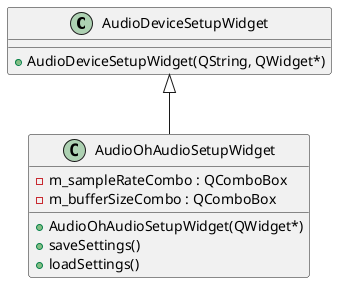

设置项：
- 采样率选择：44100Hz / 48000Hz
- 缓冲区大小选择：128 / 256 / 512 / 1024

**异常处理与回退策略**

```
AudioOhAudio构造流程:
1. 创建OH_AudioStreamBuilder → 失败? → _successful=false, return
2. 设置音频流参数 → 
3. 生成OH_AudioRenderer → 失败? → 销毁builder, _successful=false, return
4. _successful=true

启动失败回退:
1. OH_AudioRenderer_Start失败 → 记录错误日志
2. AudioEngine检测到音频设备启动失败 → 创建DummyAudioDevice
3. 用户看到"音频设备不可用，应用以静音模式运行"提示
```

### 1.3.3 Phase 3: MIDI支持（HarmonyOS MIDI API）

#### 1.3.3.1 MidiOhMidi完整实现设计

**类图**

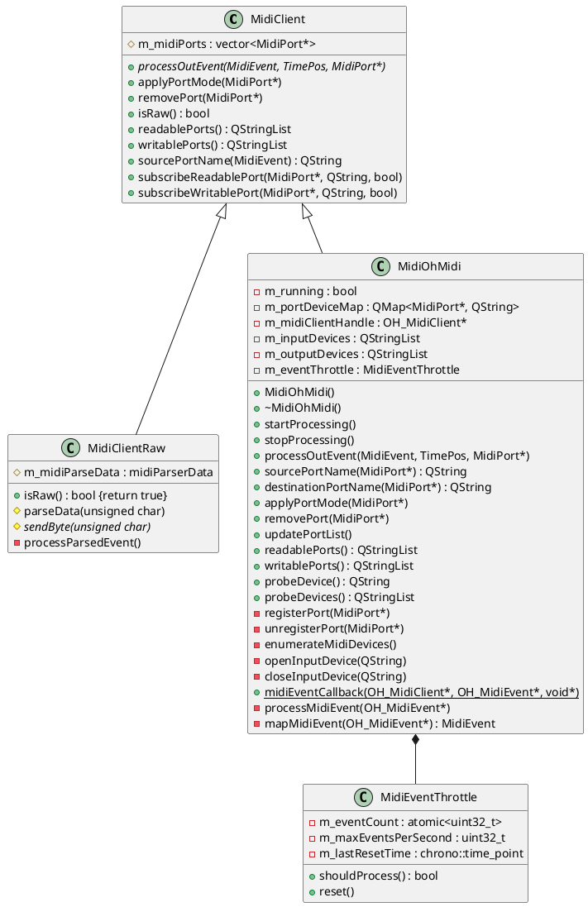

**HarmonyOS MIDI API调用序列**

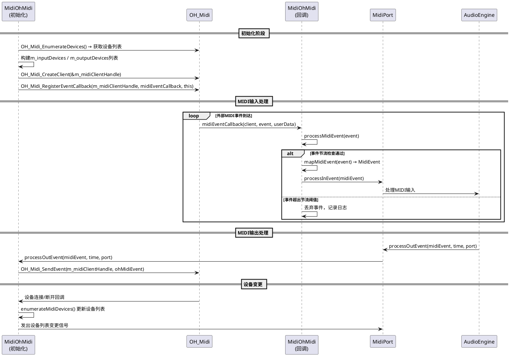

**MIDI事件映射表**

| HarmonyOS MIDI事件 | LMMS MidiEvent类型 | 映射说明 |
|-------------------|-------------------|----------|
| NoteOn (0x9n) | `MidiNoteOn` | key=note, velocity=velocity |
| NoteOff (0x8n) | `MidiNoteOff` | key=note, velocity=0 |
| ControlChange (0xBn) | `MidiControlChange` | key=controller, value=value |
| ProgramChange (0xCn) | `MidiProgramChange` | key=program |
| PitchBend (0xEn) | `MidiPitchBend` | value=结合MSB/LSB的14位值 |
| Clock (0xF8) | `MidiMetaEvent` | tempo同步，24PPQ |
| Start (0xFA) | `MidiMetaEvent` | 传输开始 |
| Stop (0xFC) | `MidiMetaEvent` | 传输停止 |

**mapMidiEvent算法**

```
算法: mapMidiEvent(ohEvent) → MidiEvent
输入: ohEvent - HarmonyOS MIDI事件结构
输出: LMMS MidiEvent

1. status = ohEvent.status
2. channel = status & 0x0F
3. type = status & 0xF0

4. switch(type):
   case 0x90 (NoteOn):
     if ohEvent.data2 == 0:  // velocity=0视为NoteOff
       return MidiEvent(MidiNoteOff, channel, ohEvent.data1, 0)
     else:
       return MidiEvent(MidiNoteOn, channel, ohEvent.data1, ohEvent.data2)
   
   case 0x80 (NoteOff):
     return MidiEvent(MidiNoteOff, channel, ohEvent.data1, ohEvent.data2)
   
   case 0xB0 (ControlChange):
     return MidiEvent(MidiControlChange, channel, ohEvent.data1, ohEvent.data2)
   
   case 0xC0 (ProgramChange):
     return MidiEvent(MidiProgramChange, channel, ohEvent.data1, 0)
   
   case 0xE0 (PitchBend):
     value = (ohEvent.data2 << 7) | ohEvent.data1  // 14位合并
     return MidiEvent(MidiPitchBend, channel, 0, value)
   
   case 0xF0 (System):
     switch(status):
       case 0xF8: return MidiEvent(MidiMetaEvent, 0, MidiClock, 0)
       case 0xFA: return MidiEvent(MidiMetaEvent, 0, MidiStart, 0)
       case 0xFC: return MidiEvent(MidiMetaEvent, 0, MidiStop, 0)
```

**MIDI事件节流 (MidiEventThrottle)**

为防止MIDI事件泛滥（如密集时钟信号），实现节流机制：

```
参数: m_maxEventsPerSecond = 10000  // 默认每秒最多处理10000事件

shouldProcess():
1. 当前时间 - m_lastResetTime > 1秒? → 重置计数器
2. m_eventCount < m_maxEventsPerSecond? → m_eventCount++, return true
3. else → return false (丢弃)
```

**设备热插拔处理**

```
设备连接回调:
1. 调用enumerateMidiDevices()刷新设备列表
2. 发出readablePortsChanged()/writablePortsChanged()信号
3. 若新设备为MIDI输入设备且用户已配置自动连接 → 自动打开

设备断开回调:
1. 标记断开的设备为offline
2. 停止从该设备接收事件
3. 发出设备列表变更信号
4. 显示通知: "MIDI设备 [设备名] 已断开连接"
5. 应用不崩溃，继续运行
```

### 1.3.4 Phase 4: 插件系统适配

#### 1.3.4.1 插件编译与加载设计

**插件分类与编译优先级**

| 类别 | 插件列表 | 依赖 | 优先级 |
|------|---------|------|--------|
| **核心Instrument** | TripleOscillator, Kicker, Organic, Sfxr | 仅lmms_core/lmms_gui | 高 |
| **高级Instrument** | Monstro, Nes, Sid, Lb302, OpulenZ, Watsyn, Xpressive, Vibed, Patman | 仅lmms_core/lmms_gui | 高 |
| **SF2/GIG播放** | Sf2Player, GigPlayer | FluidSynth/libgig | 中 |
| **核心Effect** | Amplifier, BassBooster, Bitcrush, Delay, Flanger, ReverbSC | 仅lmms_core/lmms_gui | 高 |
| **高级Effect** | Compressor, StereoEnhancer, Eq, MultitapEcho, StkEffects | FFTW3f/STK(可选) | 中 |
| **LADSPA内嵌** | Calf, Caps, CMT, SWH, TAP | LADSPA SDK | 中 |
| **Tool** | MidiImport, MidiExport, HydrogenImport, SlicerT | libsndfile | 中 |
| **排除** | Lv2, Carla, VST | - | 不编译 |

**OhosPluginLoader设计**

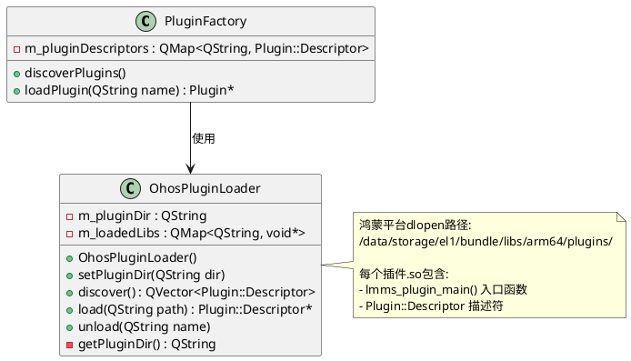

**插件加载流程**

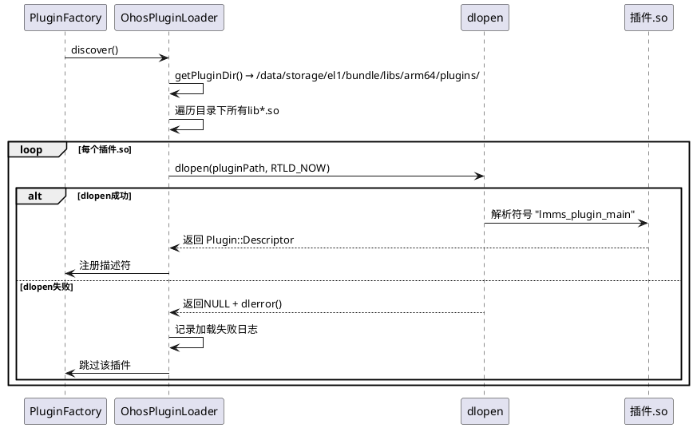

**插件崩溃隔离**

```
策略: 信号处理 + 插件卸载

1. 注册SIGSEGV/SIGABRT信号处理器
2. 在信号处理器中:
   a. 识别崩溃地址所属的插件共享库
   b. 卸载该插件 (dlclose)
   c. 从PluginFactory移除该插件
   d. 恢复AudioEngine运行
   e. 显示通知: "插件 [名称] 运行出错已卸载"

3. 替代方案（更安全）:
   a. 在Plugin::instantiableIn()中增加try-catch包装
   b. 对于关键操作（renderNextBuffer等）设置longjmp恢复点
```

### 1.3.5 Phase 5: 完整功能测试与优化

#### 1.3.5.1 性能优化设计

**启动时间优化 (目标≤5秒)**

```
冷启动流程分析:
1. HAP加载 → EntryAbility.onCreate()          ~0.5s
2. dlopen(liblmms.so) + 依赖库加载             ~1.0s
3. Qt事件循环初始化                             ~0.3s
4. PluginFactory::discover() 扫描插件           ~1.0s
5. MainWindow构造 + SongEditor初始化            ~1.0s
6. 默认项目加载                                  ~0.5s
                                        合计: ~4.3s

优化措施:
- 延迟加载: 非核心插件在后台线程扫描
- 资源预编译: .qrc资源编译到二进制，避免运行时文件读取
- 减少dlopen依赖: 将核心库静态链接为单一大.so
```

**音频延迟优化 (目标≤20ms)**

```
音频延迟组成:
1. OHAudio缓冲区延迟: 256帧 / 44100Hz ≈ 5.8ms
2. Mixer渲染时间: 通常 < 2ms (单轨道)
3. OHAudio系统延迟: 约 5-10ms (LOW latency mode)
                                    合计: ~12.8ms

优化措施:
- 使用AUDIOSTREAM_LATENCY_MODE_LOW
- 缓冲区默认256帧，高级用户可调至128帧
- Mixer使用SIMD优化（NEON on ARM64）
- 避免在音频回调中执行内存分配
```

**内存占用优化 (空闲≤200MB, 10轨道≤500MB)**

```
内存占用分析:
- Qt运行时: ~50MB
- LMMS核心+GUI: ~80MB
- 插件加载(60+): ~30MB
- 音频缓冲区: ~2MB
             空闲合计: ~162MB

10轨道项目额外:
- 每轨道音频缓冲区: ~5MB
- 每轨道Sample/Note数据: ~5MB
- 插件实例状态: ~5MB
             额外合计: ~150MB
             总计: ~312MB
```

# **2. 接口设计**

## **2.1 总体设计**

### 接口分层架构

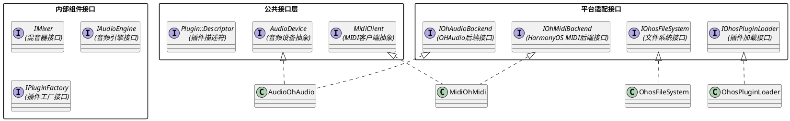

## **2.2 接口清单**

### 2.2.1 AudioOhAudio接口

| 接口方法 | 签名 | 说明 | 调用方 |
|---------|------|------|--------|
| 构造函数 | `AudioOhAudio(bool& _successful, Mixer* _mixer)` | 初始化OHAudio流，_successful返回是否成功 | AudioEngine |
| 析构函数 | `~AudioOhAudio() override` | 停止处理并销毁OHAudio资源 | 自动 |
| startProcessing | `void startProcessing() override` | 启动OHAudio渲染流 | AudioEngine |
| stopProcessing | `void stopProcessing() override` | 停止OHAudio渲染流 | AudioEngine |
| name | `QString name() const override` | 返回"OHAudio" | AudioEngine |
| instantiate | `static AudioDevice* instantiate(bool&, Mixer*, ch_cnt_t)` | 工厂方法创建实例 | AudioEngine |
| setupAudioDeviceSetupWidget | `static void setupAudioDeviceSetupWidget(AudioDeviceSetupWidget*)` | 注册OHAudio设置界面 | SetupDialog |
| audioRendererCallback | `static int32_t audioRendererCallback(OH_AudioRenderer*, void*, int32_t)` | OHAudio音频数据回调 | OHAudio系统 |
| processAudioData | `int32_t processAudioData(void* buffer, int32_t bufferLen)` | 处理音频数据并填充缓冲区 | audioRendererCallback |
| writeBuffer | `void writeBuffer(AudioSampleBuffer*, fpp_t, ch_cnt_t) override` | 写缓冲区（OHAudio回调模式下空实现） | AudioDevice基类 |

### 2.2.2 MidiOhMidi接口

| 接口方法 | 签名 | 说明 | 调用方 |
|---------|------|------|--------|
| 构造函数 | `MidiOhMidi()` | 初始化HarmonyOS MIDI客户端 | MidiClient::openMidiClient |
| 析构函数 | `~MidiOhMidi() override` | 停止处理并释放MIDI资源 | 自动 |
| startProcessing | `void startProcessing() override` | 启动MIDI事件处理 | AudioEngine |
| stopProcessing | `void stopProcessing() override` | 停止MIDI事件处理 | AudioEngine |
| processOutEvent | `void processOutEvent(const MidiEvent&, const TimePos&, const MidiPort*)` | 发送MIDI事件到外部设备 | MidiPort |
| sourcePortName | `QString sourcePortName(const MidiPort*) const override` | 获取MIDI源端口名 | MidiPort |
| destinationPortName | `QString destinationPortName(const MidiPort*) const override` | 获取MIDI目标端口名 | MidiPort |
| applyPortMode | `void applyPortMode(MidiPort*) override` | 应用端口模式变更 | MidiPort |
| removePort | `void removePort(MidiPort*) override` | 移除端口 | MidiPort |
| updatePortList | `void updatePortList() override` | 刷新设备列表 | MidiClient |
| readablePorts | `QStringList readablePorts() const override` | 可读MIDI端口列表 | SetupDialog |
| writablePorts | `QStringList writablePorts() const override` | 可写MIDI端口列表 | SetupDialog |
| probeDevice | `static QString probeDevice()` | 探测默认MIDI设备 | MidiClient |
| probeDevices | `static QStringList probeDevices()` | 探测所有MIDI设备 | SetupDialog |
| midiEventCallback | `static void midiEventCallback(OH_MidiClient*, OH_MidiEvent*, void*)` | MIDI事件回调 | HarmonyOS MIDI |
| mapMidiEvent | `MidiEvent mapMidiEvent(OH_MidiEvent*)` | 映射HM MIDI事件到LMMS MidiEvent | midiEventCallback |

### 2.2.3 OhosFileSystem接口

| 接口方法 | 签名 | 说明 |
|---------|------|------|
| appDataDir | `static QString appDataDir()` | 应用私有数据目录 |
| appCacheDir | `static QString appCacheDir()` | 应用缓存目录 |
| appResourceDir | `static QString appResourceDir()` | HAP内资源目录 |
| pluginDir | `static QString pluginDir()` | 插件目录 |
| lmmsDataDir | `static QString lmmsDataDir()` | LMMS数据目录(替代~/.lmms/) |
| mapPath | `static QString mapPath(const QString& linuxPath)` | Linux→鸿蒙路径映射 |

### 2.2.4 OhosPluginLoader接口

| 接口方法 | 签名 | 说明 |
|---------|------|------|
| setPluginDir | `void setPluginDir(QString dir)` | 设置插件搜索目录 |
| discover | `QVector<Plugin::Descriptor> discover()` | 扫描并返回所有可用插件描述符 |
| load | `Plugin::Descriptor* load(QString path)` | 加载指定插件共享库 |
| unload | `void unload(QString name)` | 卸载指定插件 |

# **4. 数据模型**

## **4.1 设计目标**

数据模型设计需满足以下目标：

1. **平台无关性**：核心数据模型（Song、Track、Clip、MidiEvent等）保持与LMMS上游完全一致，不因鸿蒙移植而修改
2. **文件格式兼容性**：.mmp/.mmpz文件读写逻辑不变，仅文件路径通过OhosFileSystem映射
3. **音频数据零拷贝**：OHAudio回调与Mixer渲染之间尽量减少数据拷贝
4. **配置持久化适配**：配置文件存储路径映射到鸿蒙应用私有目录

## **4.2 模型实现**

### 4.2.1 音频数据流模型

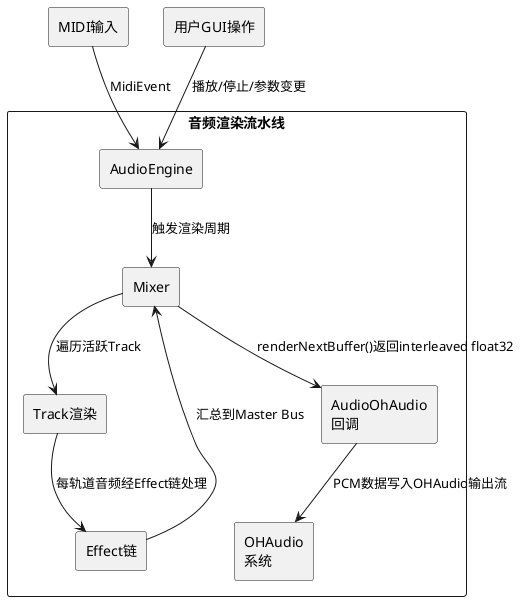

**音频缓冲区数据结构**

```
AudioSampleBuffer (LMMS内部):
  - float* m_data: 非交错PCM数据 [frame][channel]
  - fpp_t m_frames: 帧数 (默认256)
  - ch_cnt_t m_channels: 声道数 (默认2)

OHAudio输出缓冲区:
  - void* buffer: 交错float32 PCM数据 [L,R,L,R,...]
  - int32_t bufferLen: 总采样点数 = frames × channels

转换: AudioSampleBuffer → 交错float32
  for each frame:
    output[frame*2]   = input[frame][0]  // 左声道
    output[frame*2+1] = input[frame][1]  // 右声道
```

### 4.2.2 MIDI事件流模型

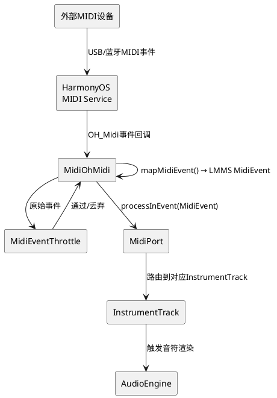

### 4.2.3 项目文件数据模型

```
.mmp/.mmpz文件结构 (不变):
<lmms-project version="1.3">
  <head>
    <attr name="bpm" value="140"/>
    <attr name="mastervol" value="100"/>
  </head>
  <song>
    <tracklist>
      <instrumenttrack> ... </instrumenttrack>
      <sampletrack> ... </sampletrack>
      <automationtrack> ... </automationtrack>
    </tracklist>
    <fxmixer> ... </fxmixer>
  </song>
</lmms-project>

鸿蒙适配点:
- DataFile读写使用OhosFileSystem::mapPath()转换路径
- 采样文件路径: 绝对路径→相对路径→映射到鸿蒙路径
- gzip压缩/解压: 使用Qt内置qUncompress()，无需zlib
```

### 4.2.4 HAP包数据模型

```
HAP包结构 (LMMS_for_HMOS.hap):
├── entry/
│   ├── libs/
│   │   └── arm64-v8a/
│   │       ├── liblmms.so              # LMMS主应用库
│   │       ├── libQt5Core.so           # Qt核心
│   │       ├── libQt5Gui.so            # Qt GUI
│   │       ├── libQt5Widgets.so        # Qt Widgets
│   │       ├── libQt5Xml.so            # Qt XML
│   │       ├── libQt5Svg.so            # Qt SVG
│   │       ├── libqtaf_ohos.so         # Qt鸿蒙平台插件
│   │       ├── libsndfile.so           # 音频文件I/O
│   │       ├── libfftw3f.so            # FFT
│   │       ├── libsamplerate.so        # 采样率转换
│   │       ├── libfluidsynth.so        # SF2播放
│   │       ├── plugins/               # LMMS插件目录
│   │       │   ├── libtripleoscillator.so
│   │       │   ├── libkicker.so
│   │       │   ├── libamplifier.so
│   │       │   ├── libsf2player.so
│   │       │   └── ... (60+插件)
│   │       └── ... (其他依赖)
│   ├── resources/
│   │   └── base/
│   │       ├── media/                  # 应用图标等
│   │       ├── profile/               # 页面路由配置
│   │       └── element/              # 字符串资源
│   └── ets/
│       ├── entryability/EntryAbility.ets
│       ├── common/QtAppConstants.ets
│       └── pages/Index.ets
```

### 4.2.5 构建系统数据模型

```
CMake构建树:
lmms-master/
├── CMakeLists.txt              # 根配置
├── cmake/
│   ├── ohos-toolchain.cmake    # 鸿蒙交叉编译工具链
│   └── modules/
│       └── DetectMachine.cmake # 平台检测(LMMS_BUILD_OHOS)
├── src/
│   ├── lmmsconfig.h.in         # 配置头文件(LMMS_BUILD_OHOS/LMMS_HAVE_OHAUDIO/LMMS_HAVE_OH_MIDI)
│   ├── core/
│   │   ├── CMakeLists.txt      # 核心库构建(条件编译音频/MIDI/LV2后端)
│   │   ├── audio/
│   │   │   ├── AudioOhAudio.h/.cpp    # Phase 2: OHAudio后端
│   │   │   └── AudioDevice.h/.cpp     # 音频设备基类
│   │   └── midi/
│   │       ├── MidiOhMidi.h/.cpp      # Phase 3: HarmonyOS MIDI后端
│   │       └── MidiClient.h/.cpp      # MIDI客户端基类
│   ├── gui/
│   │   ├── CMakeLists.txt      # GUI库构建(OHOS排除AudioAlsaSetupWidget/Lv2ViewBase)
│   │   └── AudioOhAudioSetupWidget.h/.cpp  # Phase 2: OHAudio设置界面
│   └── 3rdparty/
│       └── CMakeLists.txt      # 第三方(OHOS排除weakjack)
└── plugins/                    # 各插件子目录CMakeLists.txt

vcpkg triplet:
triplets/ohos-arm64.cmake:
  set(VCPKG_TARGET_ARCHITECTURE arm64)
  set(VCPKG_CMAKE_SYSTEM_NAME OHOS)
  set(VCPKG_CMAKE_SYSTEM_VERSION 1)
  set(VCPKG_LINKER_FLAGS "--target=aarch64-linux-ohos")
```

---

# **3. 构建系统详细设计**

## **3.1 构建流程全景**

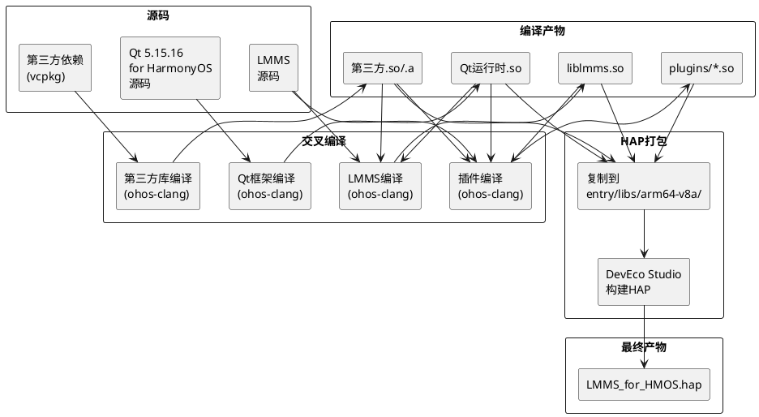

## **3.2 Qt for HarmonyOS编译配置**

```bash
# 环境变量
export NATIVE_OHOS_SDK=/path/to/HarmonyOS/SDK/native
export OHOS_SDK_SYSROOT=$NATIVE_OHOS_SDK/sysroot
export LLVM_INSTALL_DIR=$NATIVE_OHOS_SDK/llvm

# configure
./configure \
    -xplatform ohos-clang \
    -device-option CROSS_COMPILE=$LLVM_INSTALL_DIR/bin \
    -prefix /data/storage/el1/bundle/libs/arm64 \
    -extprefix $HOME/Qt/5.15.16/ohos-arm64-clang/ \
    -opensource -confirm-license -release \
    -no-use-gold-linker -no-gcc-sysroot \
    -ohos-arch arm64-v8a \
    -skip qt3d -skip qtconnectivity -skip qtlocation \
    -skip qtwayland -skip qtwebengine -skip qtx11extras \
    -no-dbus -nomake tests -nomake examples

# 编译
make -j$(nproc)
make install
```

## **3.3 LMMS CMake构建配置**

```bash
mkdir build_lmms_ohos && cd build_lmms_ohos

cmake ../lmms-master \
    -DCMAKE_TOOLCHAIN_FILE=../lmms-master/cmake/ohos-toolchain.cmake \
    -DLMMS_BUILD_OHOS=ON \
    -DCMAKE_PREFIX_PATH="$HOME/Qt/5.15.16/ohos-arm64-clang" \
    -DWANT_ALSA=OFF \
    -DWANT_OSS=OFF \
    -DWANT_PULSEAUDIO=OFF \
    -DWANT_SDL=OFF \
    -DWANT_JACK=OFF \
    -DWANT_LV2=OFF \
    -DWANT_CARLA=OFF \
    -DWANT_VST=OFF \
    -DWANT_PORTAUDIO=OFF \
    -DWANT_SOUNDIO=OFF \
    -DWANT_SNDIO=OFF \
    -DWANT_OHAUDIO=ON \
    -DWANT_OH_MIDI=ON \
    -DCMAKE_BUILD_TYPE=Release

cmake --build . -j$(nproc)
```

## **3.4 vcpkg Triplet配置**

```cmake
# triplets/ohos-arm64.cmake
set(VCPKG_TARGET_ARCHITECTURE arm64)
set(VCPKG_CMAKE_SYSTEM_NAME OHOS)
set(VCPKG_CMAKE_SYSTEM_VERSION 1)
set(VCPKG_CMAKE_SYSTEM_PROCESSOR aarch64)
set(VCPKG_CROSSCOMPILING ON)
set(VCPKG_LINKER_FLAGS "--target=aarch64-linux-ohos")

# 编译依赖
# vcpkg install libsndfile:ohos-arm64 fftw3:ohos-arm64 libsamplerate:ohos-arm64 fluidsynth:ohos-arm64
```

## **3.5 HAP打包脚本**

```powershell
# deploy_to_hap.ps1
$HAP_LIBS = "LMMS_for_HMOS\entry\libs\arm64-v8a"
$QT_INSTALL = "C:\Qt\qt-5.15.16-ohos"
$LMMS_BUILD = "build_lmms_ohos"
$VCPKG_INST = "vcpkg_installed\ohos-arm64"

# 创建目标目录
New-Item -ItemType Directory -Force -Path $HAP_LIBS
New-Item -ItemType Directory -Force -Path "$HAP_LIBS\plugins"

# 1. 复制LMMS主库
Copy-Item "$LMMS_BUILD\liblmms.so" $HAP_LIBS

# 2. 复制Qt运行时
@("libQt5Core.so","libQt5Gui.so","libQt5Widgets.so","libQt5Xml.so","libQt5Svg.so") | % {
    Copy-Item "$QT_INSTALL\lib\$_" $HAP_LIBS
}
Copy-Item "$QT_INSTALL\plugins\platforms\libqtaf_ohos.so" $HAP_LIBS

# 3. 复制第三方依赖
Copy-Item "$VCPKG_INST\lib\*.so" $HAP_LIBS

# 4. 复制插件
Copy-Item "$LMMS_BUILD\plugins\*.so" "$HAP_LIBS\plugins\"
```

---

# **5. 部署方案**

## **5.1 HAP结构设计**

```
LMMS_for_HMOS.hap
├── entry/
│   ├── libs/arm64-v8a/            # 原生库 (~80MB)
│   │   ├── liblmms.so             # LMMS主应用 (~15MB)
│   │   ├── libQt5*.so             # Qt运行时 (~30MB)
│   │   ├── libqtaf_ohos.so        # Qt平台插件 (~2MB)
│   │   ├── libsndfile.so          # 音频编解码 (~1MB)
│   │   ├── libfftw3f.so           # FFT (~3MB)
│   │   ├── libsamplerate.so       # 采样率转换 (~0.5MB)
│   │   ├── libfluidsynth.so       # SF2播放 (~5MB)
│   │   └── plugins/               # LMMS插件 (~20MB)
│   │       ├── libtripleoscillator.so
│   │       ├── libkicker.so
│   │       ├── libamplifier.so
│   │       └── ... (60+插件)
│   ├── resources/base/            # 资源文件
│   │   ├── media/                 # 图标、启动画面
│   │   ├── element/string.json    # 字符串资源
│   │   └── profile/main_pages.json
│   └── ets/                       # ETS代码
│       ├── entryability/EntryAbility.ets
│       ├── common/QtAppConstants.ets
│       └── pages/Index.ets
└── module.json                    # 模块配置
```

## **5.2 运行时库加载顺序**

```
1. 系统加载HAP → 解析module.json5
2. EntryAbility.onCreate() → 
3. dlopen("liblmms.so") → 
   自动递归加载依赖:
   ├── libQt5Widgets.so → libQt5Gui.so → libQt5Core.so
   ├── libQt5Xml.so → libQt5Core.so
   ├── libQt5Svg.so → libQt5Gui.so → libQt5Core.so
   ├── libsndfile.so
   ├── libfftw3f.so
   └── libsamplerate.so
4. Qt平台插件加载: libqtaf_ohos.so (通过QT_PLUGIN_PATH)
5. LMMS插件加载: dlopen("plugins/lib*.so") (通过OhosPluginLoader)
```

## **5.3 权限声明**

| 权限 | 类型 | 用途 | Phase |
|------|------|------|-------|
| `ohos.permission.READ_MEDIA` | user_grant | 读取音频采样文件 | Phase 1 |
| `ohos.permission.WRITE_MEDIA` | user_grant | 保存项目/导出文件 | Phase 1 |
| `ohos.permission.ACCESS_DLP_FILE` | system_grant | 文档类文件访问 | Phase 1 |

---

# **6. 数据流设计**

## **6.1 音频数据流（Phase 2）**

```plantuml
@startuml
skinparam activityDiamondFontSize 10

start
:用户点击播放;
:AudioEngine::startProcessing();
:AudioOhAudio::startProcessing();
:OH_AudioRenderer_Start(m_renderer);

repeat
  :OHAudio系统触发回调\naudioRendererCallback();
  :processAudioData(buffer, bufferLen);
  :计算帧数 = bufferLen / channels;
  :Mixer::renderNextBuffer();
  
  fork
    :遍历InstrumentTrack\n渲染音符→PCM;
  fork
    :遍历SampleTrack\n播放采样→PCM;
  fork
    :遍历AutomationTrack\n更新参数值;
  end fork
  
  :各轨道PCM汇入Mixer Bus;
  :Master Bus应用全局Effect;
  :AudioSampleBuffer → 交错float32;
  :memcpy到OHAudio buffer;
  
  if (数据不足?) then (是)
    :零填充剩余部分;
    :m_bufferUnderrunCount++;
  endif
  
  :返回0给OHAudio;
repeat while (播放中?)

:用户点击停止;
:OH_AudioRenderer_Stop(m_renderer);
stop
@enduml
```

## **6.2 MIDI事件流（Phase 3）**

```plantuml
@startuml
skinparam activityDiamondFontSize 10

start
:MidiOhMidi初始化;
:OH_Midi_EnumerateDevices();
:OH_Midi_CreateClient();
:OH_Midi_RegisterEventCallback();

repeat
  :外部MIDI事件到达\nmidiEventCallback();
  :MidiEventThrottle::shouldProcess()?;
  
  if (通过节流?) then (是)
    :mapMidiEvent(ohEvent) → MidiEvent;
    
    switch (事件类型)
    case NoteOn
      :MidiPort::processInEvent()\n→ InstrumentTrack::noteOn();
    case NoteOff
      :MidiPort::processInEvent()\n→ InstrumentTrack::noteOff();
    case ControlChange
      :更新对应AutomatableModel;
    case PitchBend
      :更新pitch bend值;
    case Clock
      :同步tempo;
    endswitch
    
  else (丢弃)
    :记录事件丢弃日志;
  endif
  
repeat while (MIDI处理中?)

stop
@enduml
```

## **6.3 GUI事件流**

```plantuml
@startuml
skinparam activityDiamondFontSize 10

start
:HarmonyOS触摸/鼠标事件;
:libqtaf_ohos.so 转换为QMouseEvent;
:Qt事件循环分发;

switch (目标控件)
case Knob
  :Knob::mousePressEvent()\n→ 计算新值\n→ valueChanged() signal\n→ AutomatableModel::setValue()\n→ 触发音频参数更新;
case Fader
  :Fader::mouseMoveEvent()\n→ 计算新值\n→ 同上;
case PianoRoll
  :PianoRoll::mousePressEvent()\n→ 添加/选择/移动音符\n→ Note对象更新\n→ Clip数据变更;
case SongEditor
  :SongEditor拖拽操作\n→ Clip位置更新\n→ Song数据变更;
case 播放按钮
  :AudioEngine::play()\n→ AudioOhAudio::startProcessing();
endswitch

:Qt Widgets重绘\npaintEvent() → QPainter;
:Qt for HarmonyOS渲染到鸿蒙窗口;
stop
@enduml
```

---

# **7. 测试方案**

## **7.1 Phase 1测试策略**

| 测试项 | 类型 | 方法 | 通过条件 |
|--------|------|------|----------|
| Qt框架编译 | 构建 | 执行configure+make | 生成libQt5Core/Gui/Widgets/Xml/Svg.so |
| LMMS核心编译 | 构建 | CMake+ohos-clang | src/core/编译无错误 |
| LMMS GUI编译 | 构建 | CMake+Qt for HarmonyOS | src/gui/编译无错误 |
| 第三方依赖编译 | 构建 | vcpkg ohos-arm64 | 所有依赖.a/.so生成 |
| HAP构建 | 构建 | DevEco Studio | HAP包生成成功 |
| HAP安装 | 集成 | hdc install | 安装到设备成功 |
| GUI显示 | 功能 | 启动应用 | LMMS MainWindow显示 |
| 无音频/MIDI | 功能 | 检查功能列表 | 无音频/MIDI功能可用 |

## **7.2 Phase 2测试策略**

| 测试项 | 类型 | 方法 | 通过条件 |
|--------|------|------|----------|
| AudioOhAudio编译 | 构建 | CMake with WANT_OHAUDIO=ON | 编译通过 |
| OHAudio设备选择 | 功能 | 设置对话框 | 列表包含OHAudio选项 |
| 音频播放 | 功能 | 创建单轨道项目并播放 | 扬声器输出音频 |
| 音频延迟 | 性能 | Round-trip延迟测试 | ≤20ms |
| 缓冲区欠载 | 异常 | CPU高负载下播放 | 零填充，无崩溃 |
| 静音回退 | 异常 | 模拟OHAudio不可用 | 回退到DummyAudioDevice |
| Linux后端排除 | 构建 | 检查编译日志 | ALSA/JACK/Pulse不参与编译 |

## **7.3 Phase 3测试策略**

| 测试项 | 类型 | 方法 | 通过条件 |
|--------|------|------|----------|
| MidiOhMidi编译 | 构建 | CMake with WANT_OH_MIDI=ON | 编译通过 |
| MIDI设备枚举 | 功能 | 连接MIDI设备 | 设置中显示设备列表 |
| MIDI NoteOn | 功能 | 按下MIDI键盘 | LMMS音符发声 |
| MIDI NoteOff | 功能 | 释放MIDI键盘 | 音符停止 |
| MIDI CC | 功能 | 旋转MIDI旋钮 | 对应参数变化 |
| MIDI事件延迟 | 性能 | 事件到音频延迟测试 | ≤5ms |
| 事件节流 | 性能 | 发送密集MIDI事件 | 丢弃超量事件，不崩溃 |
| 设备断开 | 异常 | 物理断开MIDI设备 | 通知用户，不崩溃 |
| MIDI API不可用 | 异常 | 不支持MIDI的设备 | MIDI功能禁用，其他正常 |

## **7.4 Phase 4测试策略**

| 测试项 | 类型 | 方法 | 通过条件 |
|--------|------|------|----------|
| 插件编译 | 构建 | 全量插件编译 | 所有目标插件.so生成 |
| 插件发现 | 功能 | 启动应用 | 日志显示插件加载成功 |
| Instrument GUI | 功能 | 打开TripleOscillator | 界面正确显示，旋钮可操作 |
| Effect处理 | 功能 | 加载Amplifier | 音频信号正确处理 |
| Sf2Player | 功能 | 加载SF2音色库 | 正常播放 |
| 插件加载失败 | 异常 | 放置损坏.so | 跳过插件，不崩溃 |
| 插件崩溃隔离 | 异常 | 模拟插件SIGSEGV | 应用不崩溃，卸载插件 |
| LV2/Carla/VST排除 | 构建 | 代码审查 | 无相关编译代码 |

## **7.5 Phase 5测试策略**

| 测试项 | 类型 | 方法 | 通过条件 |
|--------|------|------|----------|
| .mmp读写 | 功能 | 打开/保存/重新打开 | 数据完整一致 |
| .mmpz读写 | 功能 | 压缩格式读写 | 数据完整一致 |
| 向后兼容 | 功能 | 打开1.2.0项目 | 正确加载所有数据 |
| 损坏文件恢复 | 异常 | 打开损坏XML | 恢复可读部分 |
| WAV导出 | 功能 | 导出WAV 44100Hz 16bit | 文件可正常播放 |
| FLAC/OGG/MP3导出 | 功能 | 各格式导出 | 文件可正常播放 |
| PianoRoll编辑 | 功能 | 绘制/选择/移动/缩放/量化 | 所有操作正常 |
| AutomationEditor | 功能 | 曲线编辑/节点操作 | 所有操作正常 |
| SongEditor | 功能 | 轨道显示/Clip拖拽/缩放 | 所有操作正常 |
| 31个自定义控件 | 功能 | 逐一验证 | 渲染和交互正常 |
| 配置持久化 | 功能 | 修改设置并重启 | 设置恢复 |
| 冷启动时间 | 性能 | 计时 | ≤5秒 |
| 空闲内存 | 性能 | 性能监控 | ≤200MB |
| 10轨道内存 | 性能 | 加载10轨道项目 | ≤500MB |
| GUI帧率 | 性能 | FPS监控 | ≥30fps |
| 磁盘空间不足 | 异常 | 导出大文件 | 停止并提示 |

---

# **8. Phase间依赖与实施路线图**

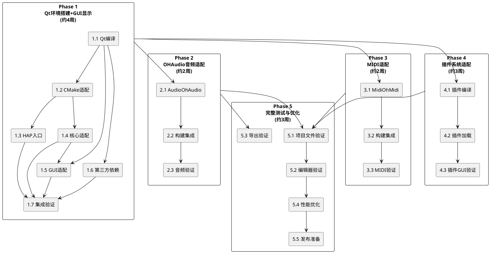

**总工期估算**: 约14周（Phase 1: 4周 + Phase 2: 2周 + Phase 3: 2周 + Phase 4: 3周 + Phase 5: 3周）

---

# **9. 风险与缓解措施**

| 风险 | 影响 | 概率 | 缓解措施 |
|------|------|------|----------|
| Qt for HarmonyOS编译失败 | 阻塞Phase 1 | 中 | 提前验证Qt 5.15.16 for HarmonyOS在目标SDK版本下的编译；保留Qt Gerrit问题追踪渠道 |
| OHAudio API行为与文档不一致 | 阻塞Phase 2 | 低 | 编写独立OHAudio测试程序先行验证；准备PulseAudio on OHOS备用方案 |
| HarmonyOS MIDI API缺失或不完整 | 阻塞Phase 3 | 中 | Phase 3可延迟，不影响Phase 2/4；MIDI API不可用时优雅降级 |
| 插件ABI不兼容 | 阻塞Phase 4 | 中 | 使用与LMMS核心相同的编译器版本和C++标准；验证ABI兼容性 |
| 31个自定义控件渲染异常 | 阻塞Phase 5 | 中 | Qt QPainter在Qt for HarmonyOS下通常可用；逐一验证，异常控件针对性修复 |
| HAP包体积过大(>100MB) | 影响分发 | 低 | 剥离非必要插件；使用llvm-strip精简符号表；考虑按需下载插件 |
| 鸿蒙沙箱限制影响文件访问 | 影响功能 | 中 | 使用OhosFileSystem统一路径映射；测试el1/el2分区访问权限 |
