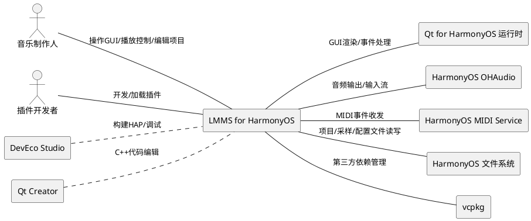
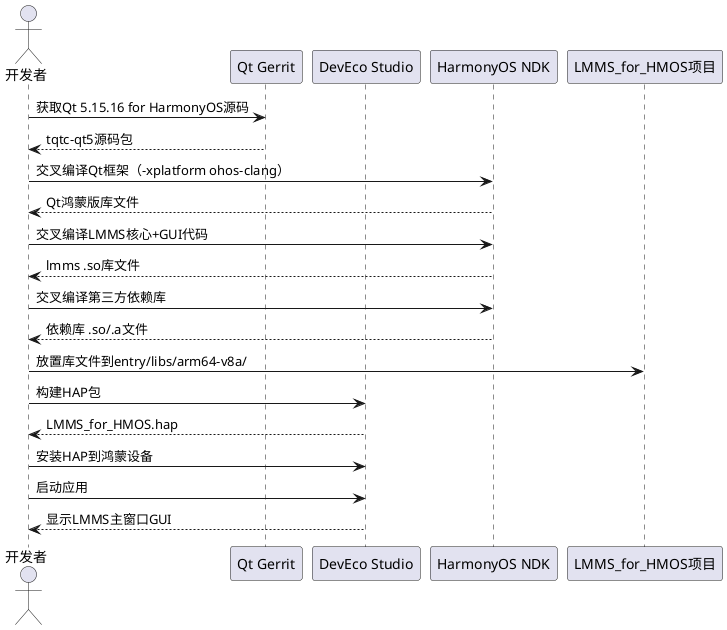
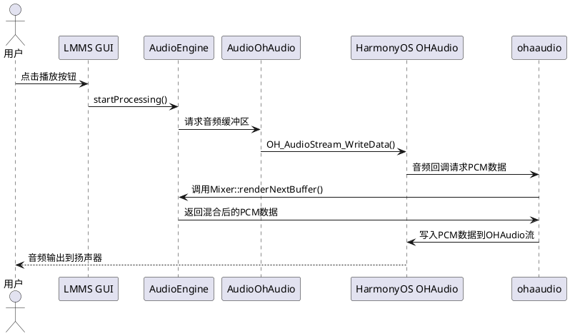
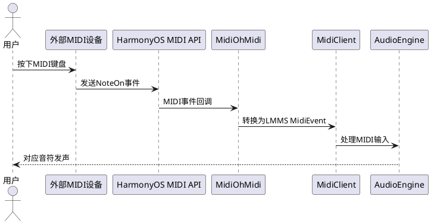
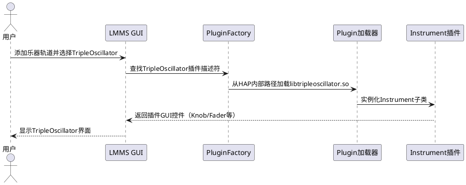
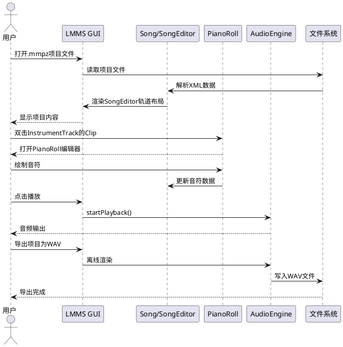
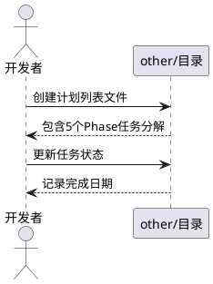
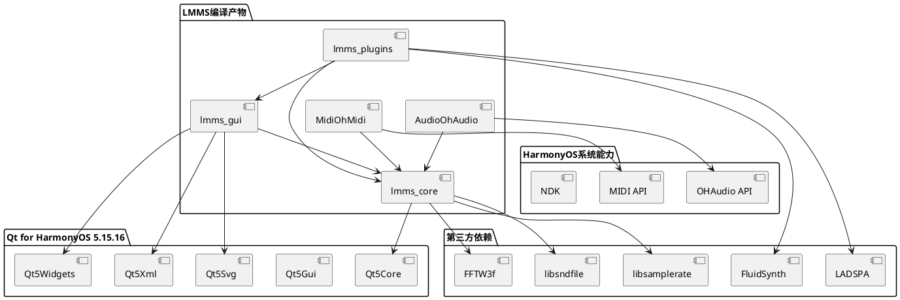

# **1. 组件定位**

## **1.1 核心职责**

本组件负责将LMMS数字音频工作站的C++核心代码与Qt Widgets GUI移植到鸿蒙OS平台运行，实现基于Qt for HarmonyOS的DAW桌面应用在鸿蒙设备上的完整可用性。

## **1.2 核心输入**

1. **LMMS 1.3.0-alpha 源码**：包含C++核心引擎、Qt Widgets GUI、60+插件的完整源代码库
2. **Qt 5.15.16 for HarmonyOS 源码**：从Qt Gerrit tqtc-qt5仓库 tqtc/harmonyos-5.15.16 分支获取的鸿蒙版Qt框架源码
3. **HarmonyOS SDK/API**：HarmonyOS SDK API Level 15+，包含OHAudio API、MIDI API、NDK工具链
4. **用户操作指令**：通过Qt Widgets GUI传递的用户交互操作（编辑音符、调整旋钮、播放/暂停等）
5. **MIDI输入信号**：来自HarmonyOS MIDI API的外部MIDI设备输入事件
6. **音频采样文件**：用户加载的WAV/FLAC/OGG/MP3等音频采样文件
7. **LMMS项目文件**：.mmp/.mmpz格式的LMMS项目数据文件

## **1.3 核心输出**

1. **音频输出流**：通过HarmonyOS OHAudio API输出的实时音频PCM数据流
2. **MIDI输出信号**：通过HarmonyOS MIDI API发送给外部MIDI设备的MIDI事件
3. **项目文件**：保存到鸿蒙文件系统的.mmp/.mmpz项目数据文件
4. **导出音频文件**：渲染导出的WAV/FLAC/OGG/MP3音频文件
5. **GUI渲染输出**：通过Qt for HarmonyOS渲染的完整DAW界面（主窗口、编辑器、控件等）
6. **HAP安装包**：最终打包生成的鸿蒙应用安装包（.hap文件）

## **1.4 职责边界**

1. **不负责**：Qt for HarmonyOS框架本身的开发与维护（作为外部依赖引入）
2. **不负责**：HarmonyOS系统级音频/MIDI驱动的开发（使用系统提供的API）
3. **不负责**：LMMS原有Linux/Windows/macOS平台的兼容性维护（移植过程不修改上游源码的跨平台逻辑）
4. **不负责**：Carla/LV2等需要复杂原生桥接的插件框架的完整适配（Phase 4仅适配核心内嵌插件）
5. **不负责**：全新的鸿蒙特有UI重新设计（保持LMMS原有Qt Widgets界面风格）
6. **不负责**：云同步、在线协作等LMMS原版不具备的网络功能

# **2. 领域术语**

**DAW（Digital Audio Workstation）**
: 数字音频工作站，用于录制、编辑、混合和制作音频文件的专业软件应用程序。

**LMMS**
: Linux MultiMedia Studio，一个开源的跨平台数字音频工作站，本项目的移植源。

**Qt for HarmonyOS**
: 将Qt框架移植到鸿蒙OS的版本，基于Qt 5.15.16，支持Core/Gui/Widgets/Xml/Svg等模块在鸿蒙平台运行。
: 备注：源码来自Qt Gerrit tqtc-qt5仓库 tqtc/harmonyos-5.15.16 分支。

**OHAudio API**
: HarmonyOS提供的低延迟原生音频输出/输入API，用于替代LMMS原有的ALSA/JACK/PulseAudio等Linux音频后端。

**HarmonyOS MIDI API**
: HarmonyOS提供的MIDI设备交互API，用于替代LMMS原有的ALSA-Seq/JACK MIDI等Linux MIDI后端。

**HAP（HarmonyOS Ability Package）**
: 鸿蒙OS应用的安装包格式，本项目最终产物。内嵌Qt应用运行时和LMMS编译产物。

**交叉编译**
: 在一个平台（如x86 Linux/Windows）上编译生成另一个平台（如ARM64鸿蒙OS）可执行代码的编译方式。
: 备注：本项目使用ohos-clang交叉编译工具链。

**AudioEngine**
: LMMS的音频引擎核心，负责音频混合、效果处理、实时播放和渲染。

**Mixer**
: LMMS的混音器组件，管理音频轨道的路由、音量、声像和效果链。

**InstrumentTrack**
: 乐器轨道，承载乐器插件实例及其关联的音符序列（Pattern/Clip）。

**AutomationTrack**
: 自动化轨道，承载可自动化参数随时间变化的控制曲线。

**SampleTrack**
: 采样轨道，承载音频采样片段（WAV/FLAC等）的播放。

**PatternTrack**
: 模式轨道，承载节拍模式（Beat/Bassline）的循环序列。

**Clip**
: 时间轴上的片段单元，承载轨道内容的容器（如音符片段、采样片段、自动化片段）。

**Knob**
: LMMS自定义的旋钮控件，用于调节连续参数（如音量、声像、截止频率等），是DAW界面的核心交互控件。
: 备注：共有31个自定义GUI控件需移植适配。

**Song**
: LMMS的项目模型，包含所有轨道、 tempo、拍号等元信息，是项目文件的内存表示。

**NDK（Native Development Kit）**
: HarmonyOS的原生开发工具链，支持C/C++代码的编译和调试。

**ETS（Extended TypeScript）**
: HarmonyOS的ArkTS/ETS声明式UI框架，本项目用作HAP入口加载Qt应用的壳层。

# **3. 角色与边界**

## **3.1 核心角色**

- **音乐制作人/编曲者**：使用LMMS鸿蒙版创建、编辑、混合音乐项目的最终用户，通过Qt Widgets GUI进行全部操作
- **插件开发者**：开发LMMS乐器/效果器插件的开发者，依赖LMMS插件API进行开发

## **3.2 外部系统**

- **Qt for HarmonyOS运行时**：提供Qt Widgets GUI渲染、事件循环、信号槽机制等基础UI能力
- **HarmonyOS OHAudio**：提供低延迟音频输出/输入的系统能力
- **HarmonyOS MIDI Service**：提供MIDI设备枚举、连接、事件收发的系统能力
- **HarmonyOS文件系统**：提供项目文件、采样文件、配置文件的读写能力
- **DevEco Studio**：鸿蒙应用开发IDE，用于项目构建、调试和HAP打包
- **Qt Creator**：Qt应用开发IDE，配合DevEco Studio进行C++代码编辑和Qt资源管理
- **vcpkg**：C++包管理器，管理LMMS第三方依赖（libsndfile, FFTW3f, libsamplerate等）

## **3.3 交互上下文**

# **4. DFX约束**

## **4.1 性能**

1. **音频延迟**：音频输出延迟应不超过20ms（从用户操作到音频输出的端到端延迟）
2. **GUI帧率**：GUI渲染帧率应不低于30fps，编辑器滚动/缩放操作应达到60fps
3. **启动时间**：应用冷启动到主窗口可操作时间应不超过5秒
4. **内存占用**：空闲状态下应用内存占用应不超过200MB，含10轨道典型项目应不超过500MB
5. **CPU占用**：空闲状态下CPU占用应不超过5%，播放状态下单轨道应不超过15%
6. **音频缓冲区**：默认缓冲区大小为256采样（44100Hz下约5.8ms），支持128/256/512/1024可配置

## **4.2 可靠性**

1. **音频连续性**：播放过程中音频中断次数应不超过1次/分钟
2. **崩溃恢复**：应用崩溃后应能恢复最近一次自动保存的项目状态
3. **文件完整性**：项目保存操作应保证文件完整性，断电/崩溃后文件不损坏
4. **插件隔离**：单个插件崩溃不应导致整个应用崩溃

## **4.3 安全性**

1. **文件访问**：应用仅能访问用户授权的目录和项目文件
2. **插件加载**：仅加载经过签名验证或用户确认的插件动态库
3. **无网络依赖**：核心功能（编辑、播放、导出）不依赖网络连接

## **4.4 可维护性**

1. **日志规范**：关键操作（音频引擎启停、文件加载/保存、插件加载）必须输出结构化日志
2. **版本追踪**：应用应显示LMMS上游版本号和鸿蒙移植版本号
3. **构建可复现**：相同源码和工具链下构建产物应完全一致

## **4.5 兼容性**

1. **HarmonyOS版本**：最低支持HarmonyOS SDK API Level 15
2. **项目文件兼容**：应能正确打开LMMS 1.2.0+创建的.mmp/.mmpz项目文件
3. **上游同步**：移植代码应保持与LMMS上游代码结构的对应关系，便于后续版本同步
4. **设备适配**：支持arm64-v8a架构的鸿蒙设备

# **5. 核心能力**

## **5.1 Phase 1: Qt for HarmonyOS环境搭建与GUI基本显示**

### **5.1.1 业务规则**

1. **Qt for HarmonyOS编译规则**：必须从Qt Gerrit tqtc-qt5仓库 tqtc/harmonyos-5.15.16 分支获取源码，使用 `-xplatform ohos-clang` 配置交叉编译Qt框架

   a. 验收条件：[执行Qt configure with -xplatform ohos-clang → make → make install] → [生成可用于鸿蒙ARM64的Qt库文件（libQt5Core.so, libQt5Gui.so, libQt5Widgets.so等）]

2. **LMMS核心代码交叉编译规则**：LMMS的src/core/下C++代码必须通过HarmonyOS NDK（ohos-clang）交叉编译为目标架构的共享库或静态库

   a. 验收条件：[使用CMake配置LMMS核心代码针对ohos-clang工具链编译] → [生成可在鸿蒙ARM64运行的lmms核心库文件]

3. **LMMS GUI代码交叉编译规则**：LMMS的src/gui/下Qt Widgets代码必须通过Qt for HarmonyOS交叉编译，与Qt Widgets库链接

   a. 验收条件：[使用CMake配置LMMS GUI代码针对Qt for HarmonyOS编译] → [生成可在鸿蒙ARM64运行的lmms_gui库文件，依赖Qt Widgets]

4. **HAP打包规则**：编译产物（.so库文件）和Qt运行时库必须放入DevEco项目的 entry/libs/arm64-v8a/ 目录，通过ETS入口（EntryAbility）加载Qt应用

   a. 验收条件：[将所有.so库放入entry/libs/arm64-v8a/并配置EntryAbility加载] → [HAP安装后启动可显示Qt Widgets窗口]

5. **第三方依赖编译规则**：libsndfile, FFTW3f, libsamplerate等第三方C/C++库必须通过HarmonyOS NDK交叉编译为鸿蒙ARM64版本

   a. 验收条件：[每个第三方库通过ohos-clang编译] → [生成对应的鸿蒙ARM64 .a/.so文件]

6. **禁止项**：禁止在Phase 1引入任何音频播放功能或MIDI功能，仅确保GUI可显示

   a. 验收条件：[Phase 1完成时启动应用] → [显示LMMS主窗口界面，无音频/MIDI功能可用]

### **5.1.2 交互流程**

### **5.1.3 异常场景**

1. **Qt for HarmonyOS编译失败**

   a. 触发条件：Qt源码在特定HarmonyOS SDK版本下configure或make失败

   b. 系统行为：记录详细编译错误日志，标识失败的具体Qt模块

   c. 用户感知：显示"Qt框架编译失败，请检查HarmonyOS SDK版本和工具链配置"错误提示

2. **LMMS核心代码编译失败**

   a. 触发条件：LMMS C++代码中使用了鸿蒙NDK不支持的API或语言特性

   b. 系统行为：记录编译错误，标识不兼容的源文件和行号

   c. 用户感知：显示"核心代码编译失败，存在平台不兼容代码"提示，并列出失败文件清单

3. **HAP启动后Qt窗口未显示**

   a. 触发条件：Qt运行时库未正确加载或ETS入口配置错误

   b. 系统行为：记录库加载失败的dlopen错误信息

   c. 用户感知：显示白屏或"应用启动失败"提示

4. **第三方依赖库缺失**

   a. 触发条件：某个必需的第三方库未编译或未放入entry/libs/目录

   b. 系统行为：运行时dlopen失败，记录缺失库名称

   c. 用户感知：应用启动崩溃，日志显示"cannot locate symbol"或"dlopen failed"

## **5.2 Phase 2: 音频引擎鸿蒙适配（OHAudio API）**

### **5.2.1 业务规则**

1. **音频后端替换规则**：必须将LMMS原有的Linux音频后端（ALSA/JACK/OSS/PulseAudio/SDL）替换为HarmonyOS OHAudio API实现

   a. 验收条件：[LMMS AudioDevice子类中实现AudioOhAudio类] → [AudioOhAudio通过OHAudio API创建音频流并输出PCM数据]

2. **AudioDevice接口兼容规则**：新的AudioOhAudio类必须继承LMMS的AudioDevice基类，实现writeBuffer、startProcessing、stopProcessing等虚函数接口

   a. 验收条件：[调用AudioOhAudio的writeBuffer方法] → [音频数据通过OHAudio API写入音频输出流]

3. **音频格式规则**：OHAudio输出必须支持float32 PCM格式，采样率支持44100Hz和48000Hz，支持立体声双声道

   a. 验收条件：[配置44100Hz/stereo/float32] → [OHAudio音频流正确输出对应格式音频]

4. **CMake构建集成规则**：AudioOhAudio编译必须集成到LMMS的CMake构建系统中，通过构建选项控制是否启用鸿蒙音频后端

   a. 验收条件：[CMake配置中启用WANT_OHAUDIO选项] → [编译AudioOhAudio.cpp并链接OHAudio库]

5. **音频设备选择规则**：用户必须能在LMMS设置对话框中选择OHAudio作为音频后端

   a. 验收条件：[打开设置对话框的音频设备选择] → [列表中包含OHAudio选项]

6. **禁止项**：禁止在鸿蒙平台上编译或启用原有的Linux音频后端代码

   a. 验收条件：[鸿蒙平台编译配置] → [ALSA/JACK/OSS/PulseAudio/SDL后端代码不参与编译]

### **5.2.2 交互流程**

### **5.2.3 异常场景**

1. **OHAudio API不可用**

   a. 触发条件：运行设备的HarmonyOS版本低于API Level 15或OHAudio服务异常

   b. 系统行为：回退到DummyAudioDevice（静音模式），记录警告日志

   c. 用户感知：显示"音频设备不可用，应用以静音模式运行"提示

2. **音频流创建失败**

   a. 触发条件：OHAudio流创建参数不合法或系统音频资源被占用

   b. 系统行为：重试一次创建，若仍失败则回退到静音模式

   c. 用户感知：显示"无法创建音频流，请检查是否有其他应用占用音频设备"提示

3. **音频缓冲区欠载（Buffer Underrun）**

   a. 触发条件：音频回调未能在规定时间内返回PCM数据

   b. 系统行为：输出零填充（静音）数据避免音频中断，记录欠载事件

   c. 用户感知：短暂静音或音频卡顿，日志中出现underrun记录

## **5.3 Phase 3: MIDI支持（HarmonyOS MIDI API）**

### **5.3.1 业务规则**

1. **MIDI后端替换规则**：必须将LMMS原有的Linux MIDI后端（ALSA-Seq/JACK-MIDI/OSS/WinMM）替换为HarmonyOS MIDI API实现

   a. 验收条件：[实现MidiOhMidi类继承MidiClient基类] → [MidiOhMidi通过HarmonyOS MIDI API收发MIDI事件]

2. **MIDI设备枚举规则**：应用启动时必须枚举所有已连接的MIDI输入/输出设备，并允许用户选择活跃设备

   a. 验收条件：[打开MIDI设置] → [显示当前已连接的MIDI设备列表，可选择输入/输出设备]

3. **MIDI事件映射规则**：HarmonyOS MIDI API的事件必须正确映射到LMMS内部的MidiEvent结构（noteOn/noteOff/controlChange/programChange/pitchBend等）

   a. 验收条件：[外部MIDI键盘按下中央C] → [LMMS接收到MidiEvent{type=NoteOn, key=60, velocity=127}]

4. **MIDI时钟同步规则**：支持接收外部MIDI时钟信号进行 tempo 同步

   a. 验收条件：[外部MIDI时钟源发送24PPQ时钟] → [LMMS tempo与外部时钟源同步]

5. **MIDI输入实时处理规则**：MIDI输入事件必须以不超过5ms的延迟传递到LMMS音频引擎处理

   a. 验收条件：[MIDI NoteOn事件到达] → [5ms内AudioEngine开始渲染对应音符音频]

6. **禁止项**：禁止在鸿蒙平台上编译或启用原有的Linux/Mac/Windows MIDI后端代码

   a. 验收条件：[鸿蒙平台编译配置] → [ALSA-Seq/JACK-MIDI/OSS/WinMM MIDI后端不参与编译]

### **5.3.2 交互流程**

### **5.3.3 异常场景**

1. **MIDI设备连接断开**

   a. 触发条件：MIDI设备在使用过程中物理断开或蓝牙连接丢失

   b. 系统行为：停止该设备的事件接收，标记设备为离线，记录日志

   c. 用户感知：显示"MIDI设备 [设备名] 已断开连接"通知

2. **MIDI API不可用**

   a. 触发条件：运行设备不支持MIDI功能或MIDI服务未启动

   b. 系统行为：MIDI功能禁用，不影响其他功能正常使用

   c. 用户感知：MIDI设置中显示"当前设备不支持MIDI功能"提示

3. **MIDI事件泛滥**

   a. 触发条件：MIDI设备短时间内发送大量事件（如MIDI时钟密集发送）

   b. 系统行为：对MIDI事件进行节流处理，丢弃超出处理能力的事件

   c. 用户感知：部分MIDI事件可能丢失，日志记录事件丢弃数量

## **5.4 Phase 4: 插件系统适配**

### **5.4.1 业务规则**

1. **内嵌插件编译规则**：LMMS自带的核心内嵌插件（TripleOscillator、Kicker、BitInvader、Watsyn、Monstro、Sf2Player等）必须通过Qt for HarmonyOS和NDK交叉编译

   a. 验收条件：[编译内嵌插件源码] → [生成可在鸿蒙ARM64运行的插件.so文件，放入HAP包的plugins目录]

2. **插件加载路径规则**：鸿蒙平台上插件搜索路径必须指向HAP包内的plugins目录（应用私有目录）

   a. 验收条件：[LMMS启动时扫描插件目录] → [从HAP内部路径加载已编译的插件共享库]

3. **Instrument插件适配规则**：Instrument类型插件必须正确继承Instrument基类，其GUI控件通过Qt Widgets正常显示

   a. 验收条件：[加载TripleOscillator插件] → [插件GUI在鸿蒙设备上正确显示，旋钮/滑块可操作]

4. **Effect插件适配规则**：Effect类型插件必须正确继承Effect基类，实时处理音频数据

   a. 验收条件：[加载Amplifier效果器] → [音频信号经过效果器处理后输出]

5. **LADSPA插件限制规则**：Phase 4仅适配LMMS内嵌的LADSPA效果器，不提供外部LADSPA SDK的完整支持

   a. 验收条件：[使用内嵌LADSPA效果器] → [效果器正常工作]；[尝试加载外部LADSPA插件] → [显示"暂不支持外部LADSPA插件"提示]

6. **LV2/Carla/VST排除规则**：Phase 4不适配LV2、Carla、VST等复杂插件框架

   a. 验收条件：[鸿蒙版LMMS] → [不包含LV2/Carla/VST相关编译代码和运行时支持]

### **5.4.2 交互流程**

### **5.4.3 异常场景**

1. **插件共享库加载失败**

   a. 触发条件：插件.so文件损坏、ABI不兼容或依赖库缺失

   b. 系统行为：跳过该插件，记录加载失败日志，不影响其他插件和应用运行

   c. 用户感知：插件列表中不显示该插件，日志记录"dlopen failed"信息

2. **插件GUI渲染异常**

   a. 触发条件：插件自定义控件的paintEvent在Qt for HarmonyOS下渲染异常

   b. 系统行为：显示插件窗口但标记为"渲染异常"，记录具体控件信息

   c. 用户感知：插件界面显示不完整或控件位置错乱

3. **插件运行时崩溃**

   a. 触发条件：插件内部代码产生段错误或未捕获异常

   b. 系统行为：捕获崩溃信号，卸载该插件，恢复音频引擎运行

   c. 用户感知：显示"插件 [名称] 运行出错已卸载"通知，项目继续运行

## **5.5 Phase 5: 完整功能测试与优化**

### **5.5.1 业务规则**

1. **项目文件操作规则**：必须支持.mmp（XML明文）和.mmpz（XML gzip压缩）格式的完整读写

   a. 验收条件：[打开一个LMMS 1.2.0创建的.mmpz项目] → [所有轨道、音符、自动化数据正确加载并在GUI中显示]

2. **导出音频规则**：必须支持将项目渲染导出为WAV/FLAC/OGG/MP3格式文件

   a. 验收条件：[选择导出为WAV 44100Hz 16bit] → [生成完整的WAV音频文件到用户指定路径]

3. **自动化编辑规则**：AutomationEditor必须正确显示和编辑自动化曲线，支持节点添加/删除/拖拽

   a. 验收条件：[打开AutomationEditor] → [自动化曲线正确渲染，可添加/移动/删除控制节点]

4. **PianoRoll编辑规则**：PianoRoll编辑器必须正确显示和编辑音符，支持音符绘制/删除/拖拽/缩放/量化

   a. 验收条件：[打开PianoRoll] → [音符正确显示在网格上，可绘制/选择/移动/调整音符长度]

5. **SongEditor操作规则**：SongEditor必须正确显示轨道布局和Clip片段，支持拖拽排列、缩放、滚动

   a. 验收条件：[打开SongEditor] → [所有轨道和Clip正确显示，可拖拽排列Clip、调整轨道顺序]

6. **配置持久化规则**：用户设置（音频设备、MIDI设备、缓冲区大小、界面偏好）必须持久化到鸿蒙应用私有目录

   a. 验收条件：[修改设置并重启应用] → [设置恢复为上次修改后的值]

7. **31个自定义控件适配规则**：所有LMMS自定义控件（Knob, Fader, Graph, ComboBox, LedCheckbox, TabWidget, GroupBox等31个）必须在Qt for HarmonyOS下正确渲染和交互

   a. 验收条件：[任意LMMS自定义控件在鸿蒙设备上显示] → [外观与Linux版一致，鼠标/触摸操作正常响应]

### **5.5.2 交互流程**

### **5.5.3 异常场景**

1. **项目文件损坏或格式不兼容**

   a. 触发条件：打开的.mmp/.mmpz文件XML结构损坏或版本过旧

   b. 系统行为：尝试恢复可解析的部分数据，记录损坏详情

   c. 用户感知：显示"项目文件部分数据已损坏，已恢复可读内容"警告

2. **导出过程中磁盘空间不足**

   a. 触发条件：渲染导出大文件时磁盘空间耗尽

   b. 系统行为：停止渲染，删除已写入的部分文件

   c. 用户感知：显示"磁盘空间不足，导出失败"提示

3. **触摸操作与Qt控件冲突**

   a. 触发条件：鸿蒙触摸事件与Qt Widgets控件的mouseEvent处理不兼容

   b. 系统行为：将触摸事件映射为对应的鼠标事件传递给Qt控件

   c. 用户感知：触摸操作（拖拽旋钮、滑动Fader等）响应正常

## **5.6 计划列表管理**

### **5.6.1 业务规则**

1. **计划列表存放规则**：项目计划列表必须存放在LMMS_for_HMOS/other/目录下

   a. 验收条件：[查看other/目录] → [包含按Phase组织的计划列表文件]

2. **计划列表内容规则**：计划列表必须包含5个Phase的任务分解，每个任务标注状态（待开始/进行中/已完成）、优先级和前置依赖

   a. 验收条件：[打开计划列表] → [每个Phase有明确任务清单，任务间依赖关系清晰]

3. **计划列表更新规则**：每完成一个任务必须更新其状态，记录完成日期

   a. 验收条件：[标记任务为已完成] → [任务状态更新为"已完成"，记录完成时间]

### **5.6.2 交互流程**

### **5.6.3 异常场景**

1. **计划列表文件缺失**

   a. 触发条件：other/目录下无计划列表文件

   b. 系统行为：生成默认计划列表模板

   c. 用户感知：other/目录自动生成计划列表文件

# **6. 数据约束**

## **6.1 LMMS项目文件（.mmp/.mmpz）**

1. **文件格式**：.mmp为XML明文格式，.mmpz为gzip压缩的XML格式
2. **根元素**：XML根元素必须为`<lmms-project>`，包含version属性标注LMMS版本
3. **编码**：XML声明编码必须为UTF-8
4. **向后兼容**：必须能读取LMMS 1.2.0+版本创建的项目文件

## **6.2 音频流配置**

1. **采样率**：支持44100Hz和48000Hz，默认44100Hz
2. **位深度**：内部处理使用32-bit float，导出支持16-bit/24-bit/32-bit integer和32-bit float
3. **声道数**：输出支持立体声（2声道），内部总线支持任意声道数
4. **缓冲区大小**：支持128/256/512/1024采样，默认256

## **6.3 MIDI事件**

1. **消息类型**：必须支持NoteOn(0x9)、NoteOff(0x8)、ControlChange(0xB)、ProgramChange(0xC)、PitchBend(0xE)、Clock(0xF8)、Start(0xFA)、Stop(0xFC)
2. **通道范围**：0-15（16个MIDI通道）
3. **音符范围**：0-127（128个MIDI音符，对应C-1到G9）
4. **力度范围**：1-127（NoteOn力度0按NoteOff处理）

## **6.4 插件信息**

1. **插件类型**：Instrument、Effect、Tool三大类型
2. **插件名称**：每个插件必须有唯一标识名称（与LMMS上游一致）
3. **插件版本**：每个插件必须标注版本号（major.minor.patch格式）
4. **插件路径**：鸿蒙平台插件存放路径为HAP应用私有目录下的plugins/子目录

## **6.5 应用配置**

1. **bundleName**：com.example.LMMS_for_HMOS
2. **最低SDK版本**：HarmonyOS SDK API Level 15
3. **目标架构**：arm64-v8a
4. **Qt版本**：Qt 5.15.16 for HarmonyOS
5. **LMMS版本**：1.3.0-alpha (HarmonyOS Port)

---

# **7. EARS格式需求汇总**

> 本章节以EARS（Easy Approach to Requirements Syntax）格式，按Ubiquitous/EventDriven/StateDriven/UnwantedBehaviour/Optional五类模式，对全部核心需求进行系统性表述。

## **7.1 Ubiquitous Requirements（普遍需求）**

> 模式：The [system] shall [response/action]
> 适用场景：始终有效的根本性需求

- **U-01**: The LMMS for HarmonyOS shall 在鸿蒙OS设备上以HAP包形式安装并启动
- **U-02**: The LMMS for HarmonyOS shall 通过Qt for HarmonyOS渲染所有Qt Widgets GUI界面
- **U-03**: The LMMS for HarmonyOS shall 保持与LMMS上游1.3.0-alpha的C++核心代码逻辑一致性
- **U-04**: The LMMS for HarmonyOS shall 支持打开和保存.mmp/.mmpz格式项目文件
- **U-05**: The LMMS for HarmonyOS shall 在应用启动时扫描并加载HAP内部plugins目录下的插件
- **U-06**: The LMMS for HarmonyOS shall 支持arm64-v8a目标架构
- **U-07**: The LMMS for HarmonyOS shall 最低支持HarmonyOS SDK API Level 15

## **7.2 Event-Driven Requirements（事件驱动需求）**

> 模式：When [event], the [system] shall [response/action]
> 适用场景：响应特定事件或触发条件

- **ED-01**: When 用户点击播放按钮, the AudioEngine shall 启动OHAudio音频流并开始实时音频输出
- **ED-02**: When 用户点击停止按钮, the AudioEngine shall 停止OHAudio音频流并终止音频输出
- **ED-03**: When 外部MIDI设备发送NoteOn事件, the MidiOhMidi shall 将其转换为LMMS MidiEvent并传递给AudioEngine处理
- **ED-04**: When 外部MIDI设备断开连接, the MidiOhMidi shall 标记设备为离线并通知用户
- **ED-05**: When 用户选择导出音频, the RenderManager shall 执行离线渲染并将结果写入指定格式的音频文件
- **ED-06**: When 用户打开项目文件, the DataFile shall 解析XML数据并恢复Song模型的所有轨道和Clip数据
- **ED-07**: When 用户保存项目, the DataFile shall 将Song模型序列化为XML并写入.mmp/.mmpz文件
- **ED-08**: When AudioEngine请求音频缓冲区, the AudioOhAudio shall 通过OHAudio回调提供混合后的PCM数据
- **ED-09**: When 用户在PianoRoll中绘制音符, the PianoRoll shall 更新对应Clip的Note数据并刷新显示
- **ED-10**: When 用户在AutomationEditor中移动控制节点, the AutomationEditor shall 更新AutomationClip的节点数据并重新计算曲线
- **ED-11**: When HAP应用启动, the EntryAbility shall 加载Qt运行时库并初始化LMMS主窗口
- **ED-12**: When 用户在设置中选择OHAudio设备, the ConfigManager shall 持久化音频设备配置并在下次启动时应用
- **ED-13**: When 插件加载失败, the PluginFactory shall 跳过该插件并记录错误日志，不影响应用继续运行

## **7.3 State-Driven Requirements（状态驱动需求）**

> 模式：While [precondition], the [system] shall [response/action]
> 适用场景：依赖系统状态或前置条件的行为

- **SD-01**: While 音频引擎处于播放状态, the AudioOhAudio shall 持续通过OHAudio API输出实时音频PCM数据流
- **SD-02**: While OHAudio API不可用, the LMMS for HarmonyOS shall 以DummyAudioDevice（静音模式）运行
- **SD-03**: While MIDI设备已连接, the MidiOhMidi shall 持续监听并转发MIDI输入事件
- **SD-04**: While 项目有未保存的修改, the MainWindow shall 在标题栏显示修改标记（*号）
- **SD-05**: While 音频缓冲区大小配置为256采样, the AudioOhAudio shall 以256采样/周期的频率请求音频数据
- **SD-06**: While 用户正在拖拽Knob控件, the Knob shall 实时更新关联的AutomatableModel值并触发参数变化通知
- **SD-07**: While 插件GUI窗口已打开, the 插件控件 shall 响应用户交互并实时更新音频参数
- **SD-08**: While 应用处于后台状态, the AudioEngine shall 暂停音频输出以节省系统资源

## **7.4 Unwanted Behaviour Requirements（非预期行为需求）**

> 模式：If [trigger], the [system] shall [response/action]
> 适用场景：系统对错误、故障或非预期情况的处理

- **UB-01**: If OHAudio音频流创建失败, the AudioOhAudio shall 回退到静音模式并显示错误提示
- **UB-02**: If 音频回调未能在规定时间内返回PCM数据, the AudioOhAudio shall 输出零填充数据避免音频中断并记录欠载事件
- **UB-03**: If 外部MIDI设备短时间内发送大量事件, the MidiOhMidi shall 执行事件节流处理丢弃超量事件
- **UB-04**: If 插件共享库加载失败（ABI不兼容或依赖缺失）, the PluginFactory shall 跳过该插件并记录dlopen错误信息
- **UB-05**: If 插件运行时产生段错误, the LMMS for HarmonyOS shall 捕获崩溃信号、卸载该插件并恢复音频引擎运行
- **UB-06**: If 项目文件XML结构损坏, the DataFile shall 尝试恢复可解析的部分数据并警告用户
- **UB-07**: If 导出渲染过程中磁盘空间不足, the RenderManager shall 停止渲染并删除已写入的部分文件
- **UB-08**: If Qt运行时库加载失败, the EntryAbility shall 显示应用启动失败提示并记录dlopen错误
- **UB-09**: If LMMS核心代码与鸿蒙NDK不兼容, the 构建系统 shall 报告编译错误并标识不兼容的源文件和行号
- **UB-10**: If HarmonyOS MIDI API不可用, the LMMS for HarmonyOS shall 禁用MIDI功能但不影响其他功能正常运行

## **7.5 Optional Feature Requirements（可选功能需求）**

> 模式：Where [feature is included], the [system] shall [response/action]
> 适用场景：可选或条件性功能需求

- **OP-01**: Where HarmonyOS设备支持MIDI功能, the LMMS for HarmonyOS shall 提供完整的MIDI输入/输出设备枚举和事件处理
- **OP-02**: Where 项目使用LV2/Carla/VST插件, the LMMS for HarmonyOS shall 在加载时显示"暂不支持该插件类型"提示而非崩溃
- **OP-03**: Where 用户尝试加载外部LADSPA插件, the LMMS for HarmonyOS shall 显示"暂不支持外部LADSPA插件"提示
- **OP-04**: Where HarmonyOS设备支持48000Hz采样率, the AudioOhAudio shall 允许用户选择48000Hz作为音频输出采样率
- **OP-05**: Where 构建配置启用WANT_OHAUDIO, the CMake shall 编译AudioOhAudio.cpp并链接OHAudio库
- **OP-06**: Where 构建配置启用WANT_OH_MIDI, the CMake shall 编译MidiOhMidi.cpp并链接HarmonyOS MIDI库
- **OP-07**: Where LMMS上游发布新版本, the 移植代码 shall 保持与上游代码结构的对应关系以支持版本同步

---

# **8. 约束条件**

## **8.1 技术约束**

1. **C++标准**：必须使用C++20（与LMMS上游一致），鸿蒙NDK需支持C++20特性
2. **Qt版本**：必须使用Qt 5.15.16 for HarmonyOS，不可使用Qt 6.x
3. **构建系统**：LMMS核心/GUI代码使用CMake构建，鸿蒙HAP使用DevEco Studio（hvigor）构建
4. **双IDE协作**：开发流程需要DevEco Studio（HAP构建/调试）和Qt Creator（C++代码编辑/Qt资源管理）配合使用
5. **交叉编译**：LMMS代码和第三方依赖必须通过ohos-clang交叉编译工具链编译
6. **HAP嵌入Qt**：Qt应用运行时库和LMMS编译产物必须嵌入HAP包的entry/libs/arm64-v8a/目录
7. **ETS入口**：HAP的EntryAbility.ets必须作为启动入口，加载并初始化嵌入的Qt应用

## **8.2 平台约束**

1. **最低API Level**：HarmonyOS SDK API Level 15
2. **目标架构**：仅arm64-v8a
3. **无X11/Wayland**：鸿蒙平台无X11/Wayland显示服务，Qt for HarmonyOS使用鸿蒙原生窗口系统
4. **无ALSA/JACK/PulseAudio**：鸿蒙平台无Linux音频子系统，必须使用OHAudio API
5. **无ALSA-Seq/JACK-MIDI**：鸿蒙平台无Linux MIDI子系统，必须使用HarmonyOS MIDI API

## **8.3 依赖约束**

1. **Qt模块依赖**：Core, Gui, Widgets, Xml, Svg（Qt for HarmonyOS必须支持这些模块）
2. **第三方库依赖**：libsndfile, FFTW3f, libsamplerate（必须为鸿蒙ARM64版本）
3. **排除的依赖**：SDL2, PortAudio, JACK, ALSA（鸿蒙平台不使用，由OHAudio替代）
4. **排除的插件框架**：LV2, Carla, VST（Phase 1-4不适配）

## **8.4 过程约束**

1. **分阶段实施**：必须按Phase 1→2→3→4→5顺序逐步实施，前一Phase完成验证后方可进入下一Phase
2. **计划列表维护**：实施过程必须在other/目录维护计划列表，实时更新任务状态
3. **上游代码尊重**：移植修改应尽量通过平台条件编译（#ifdef）实现，不修改LMMS核心业务逻辑
4. **先GUI后音频**：Phase 1优先实现GUI显示，音频/MIDI功能后续Phase逐步接入

# **9. 依赖关系**

## **9.1 Phase间依赖**

| Phase | 依赖 | 说明 |
|-------|------|------|
| Phase 1 | 无 | 基础环境搭建，无前置依赖 |
| Phase 2 | Phase 1 | 音频适配需要核心代码编译基础和GUI可运行 |
| Phase 3 | Phase 1 | MIDI适配需要核心代码编译基础，不依赖Phase 2 |
| Phase 4 | Phase 1 | 插件适配需要核心编译基础和Qt Widgets可用 |
| Phase 5 | Phase 2, Phase 3, Phase 4 | 完整测试需要音频+MIDI+插件功能就绪 |

## **9.2 外部依赖**

| 依赖项 | 版本 | 用途 | 获取方式 |
|--------|------|------|----------|
| Qt for HarmonyOS | 5.15.16 | GUI框架 | Qt Gerrit tqtc-qt5 tqtc/harmonyos-5.15.16 |
| HarmonyOS SDK | API Level 15+ | 系统能力 | DevEco Studio内置 |
| HarmonyOS NDK | ohos-clang | 交叉编译 | DevEco Studio内置 |
| libsndfile | 1.x | 音频文件读写 | vcpkg交叉编译 |
| FFTW3f | 3.x | FFT计算 | vcpkg交叉编译 |
| libsamplerate | 0.x | 采样率转换 | vcpkg交叉编译 |
| FluidSynth | 2.x | SF2音色库播放 | vcpkg交叉编译（Sf2Player插件依赖） |
| STK | 4.x | 物理建模合成 | vcpkg交叉编译（可选插件依赖） |
| LADSPA SDK | 1.x | LADSPA效果器 | vcpkg交叉编译 |

## **9.3 构建依赖关系图**

# **10. 验收标准**

## **10.1 Phase 1验收标准**

| 编号 | 验收项 | 验收条件 | 验收方法 |
|------|--------|----------|----------|
| P1-01 | Qt for HarmonyOS编译 | configure -xplatform ohos-clang && make成功，生成libQt5Core/Gui/Widgets.so | 检查编译产物 |
| P1-02 | LMMS核心代码交叉编译 | CMake + ohos-clang编译src/core/成功 | 检查编译产物 |
| P1-03 | LMMS GUI代码交叉编译 | CMake + Qt for HarmonyOS编译src/gui/成功 | 检查编译产物 |
| P1-04 | 第三方依赖编译 | libsndfile/FFTW3f/libsamplerate鸿蒙ARM64版本编译成功 | 检查编译产物 |
| P1-05 | HAP构建与安装 | DevEco Studio构建HAP成功，可安装到鸿蒙设备 | 实机安装验证 |
| P1-06 | GUI主窗口显示 | 启动HAP后显示LMMS MainWindow界面（SongEditor/工具栏/侧边栏） | 目视验证 |
| P1-07 | 无音频/MIDI功能 | Phase 1完成时应用不包含音频播放和MIDI功能 | 功能验证 |

## **10.2 Phase 2验收标准**

| 编号 | 验收项 | 验收条件 | 验收方法 |
|------|--------|----------|----------|
| P2-01 | AudioOhAudio类实现 | 继承AudioDevice，实现writeBuffer/startProcessing/stopProcessing | 代码审查 |
| P2-02 | OHAudio音频输出 | 点击播放按钮后能通过扬声器听到音频 | 实机播放验证 |
| P2-03 | 音频设备选择 | 设置对话框中可选择OHAudio设备 | UI验证 |
| P2-04 | 音频延迟达标 | 端到端音频延迟≤20ms | 延迟测试 |
| P2-05 | Linux音频后端禁用 | 鸿蒙构建中ALSA/JACK/PulseAudio代码不参与编译 | 构建日志审查 |
| P2-06 | 静音回退 | OHAudio不可用时自动回退到静音模式 | 模拟API不可用测试 |

## **10.3 Phase 3验收标准**

| 编号 | 验收项 | 验收条件 | 验收方法 |
|------|--------|----------|----------|
| P3-01 | MidiOhMidi类实现 | 继承MidiClient，实现HarmonyOS MIDI API事件收发 | 代码审查 |
| P3-02 | MIDI设备枚举 | 设置中显示已连接MIDI设备列表 | 连接MIDI设备验证 |
| P3-03 | MIDI NoteOn响应 | 外部MIDI键盘NoteOn触发LMMS音符发声 | 实机MIDI输入测试 |
| P3-04 | MIDI事件延迟 | MIDI事件到音频输出延迟≤5ms | 延迟测试 |
| P3-05 | Linux MIDI后端禁用 | 鸿蒙构建中ALSA-Seq/JACK-MIDI不参与编译 | 构建日志审查 |
| P3-06 | MIDI设备断开处理 | MIDI设备断开后应用不崩溃并通知用户 | 物理断开设备测试 |

## **10.4 Phase 4验收标准**

| 编号 | 验收项 | 验收条件 | 验收方法 |
|------|--------|----------|----------|
| P4-01 | 内嵌插件编译 | TripleOscillator/Kicker/Sf2Player等插件鸿蒙ARM64版本编译成功 | 检查编译产物 |
| P4-02 | 插件加载 | 启动时自动加载HAP内plugins目录下所有插件 | 启动日志验证 |
| P4-03 | Instrument插件GUI | TripleOscillator界面正确显示，旋钮可操作 | UI验证 |
| P4-04 | Effect插件处理 | Amplifier效果器正确处理音频信号 | 音频输出验证 |
| P4-05 | 插件崩溃隔离 | 单个插件崩溃不影响应用运行 | 模拟崩溃测试 |
| P4-06 | LV2/Carla/VST排除 | 鸿蒙版不包含LV2/Carla/VST相关代码 | 代码审查 |

## **10.5 Phase 5验收标准**

| 编号 | 验收项 | 验收条件 | 验收方法 |
|------|--------|----------|----------|
| P5-01 | 项目文件读写 | 打开/保存.mmp和.mmpz文件数据完整 | 读写对比验证 |
| P5-02 | 项目向后兼容 | 打开LMMS 1.2.0项目文件成功 | 使用1.2.0项目测试 |
| P5-03 | 音频导出 | 导出WAV/FLAC/OGG/MP3文件可正常播放 | 导出后播放验证 |
| P5-04 | PianoRoll编辑 | 音符绘制/选择/移动/缩放/量化功能正常 | 逐一功能验证 |
| P5-05 | AutomationEditor | 自动化曲线编辑/节点操作功能正常 | 逐一功能验证 |
| P5-06 | SongEditor操作 | 轨道显示/Clip拖拽/缩放/滚动正常 | UI交互验证 |
| P5-07 | 31个自定义控件 | 所有LMMS自定义控件渲染和交互正常 | 逐一控件验证 |
| P5-08 | 配置持久化 | 修改设置后重启应用配置保持 | 重启验证 |
| P5-09 | 启动时间 | 冷启动到主窗口可操作≤5秒 | 计时验证 |
| P5-10 | 内存占用 | 空闲状态≤200MB，10轨道典型项目≤500MB | 性能监控验证 |
| P5-11 | 计划列表 | other/目录包含完整的5 Phase计划列表 | 文件检查验证 |
